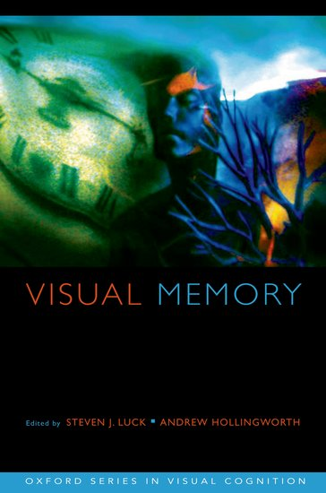
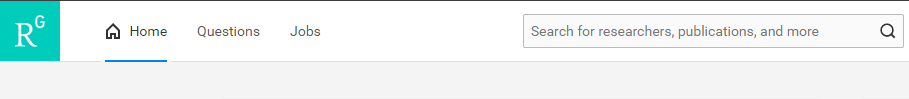
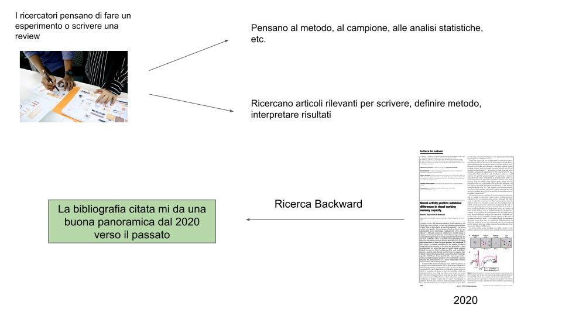

# Ricerca Bibliografica

.pull-up[
La ricerca bibliografica consiste nel **ricercare informazioni** contenute in articoli, libri e risorse elettroniche che vengono pubblicate e delle quali si conoscono in modo più e meno chiaro le **fonti**.
]

.pull-down[
```{r, echo=FALSE, out.height=300, fig.align='center'}
knitr::include_graphics("img/library.jpg")
```
]

---
class: title-slide-section-grey, center, middle

# Principali Tipologie di Pubblicazioni

---

# Rivista Scientifica

```{r, echo=FALSE, out.height=200, fig.align='center'}
knitr::include_graphics("img/nature.svg")
```
```{r, echo=FALSE, out.width=500, fig.align='center', out.height=220}
knitr::include_graphics("img/science.jpg")
```
---

# Libri

### In particolare gli **handbooks**

.pull-left[
```{r, echo=FALSE, out.height= 350, out.width= 280}

```
]
.pull-right[
```{r, echo=FALSE, out.height= 350, out.width= 280}

```
]

---

# Risorse Elettroniche

[Scholarpedia](http://www.scholarpedia.org)


[Jove](https://www.jove.com/)

```{r, echo=FALSE, out.height=200, fig.align='center'}

```

---
class: title-slide-section-grey, center, middle

# Dove trovare queste risorse?

---

# I database bibliografici

* ### La letteratura scientifica, sopratutto in forma di articoli e libri, viene **organizzata** in databases 
* ### In questi database sono presenti le varie **riviste scientifiche**

```{r, echo=FALSE, out.height=100, out.width=200, fig.align='center'}
knitr::include_graphics(c("img/webofscience.png", "img/scopus.jpg", "img/psyinfo.png"))
```

---

# I database bibliografici

* ### I ricercatori pubblicano un articolo su una **rivista**
* ### Questa rivista è **indicizzata** in una certa banca dati
* ### Avendo **accesso alla banca dati** si ottiene l'accesso a tutte le riviste indicizzate
* ### Esiste un **abbonamento** alle riviste (acquistato dall'università) ed anche alle banche dati

---
class: title-slide-section-grey, center, middle

# Come accedere a queste risorse?

---

# Problematiche di accesso

* ### Le banche dati possono essere liberamente accessibili (non proprio tutte) ma spesso gli **articoli sono a pagamento**
* ### Noi non abbiamo gli abbonamenti alle riviste o alle banche dati quindi:

.pull-left[

```{r, echo=FALSE, out.height=250, out.width=300}

```

]

.pull-right[

```{r, echo=FALSE, fig.align='center'}

```

]

---

# Servizio Proxy Unipd

### Permette di accedere da casa attraverso i **server dell'università** sfruttando tutti gli accessi e abbonamenti 
### Installazione molto semplice tramite [Auth-Proxy](https://bibliotecadigitale.cab.unipd.it/bd/auth-proxy)
### E' disponibile anche un'**estensione per Chrome/Firefox** per accendere e spegnere il servizio di proxy

---

# Link Speciali delle Banche Dati

### Oltre al servizio proxy il sistema bibliotecario di Padova offre diverse risorse e documenti come tutorial per accedere ai vari servizi

### Ci sono nel [sito delle risorse elettroniche](http://bibliotecadigitale.cab.unipd.it/resourcefacetednavigation/#c9=S&b_start=0&c5=PSICOLOGIA) i vari link alle banche dati come **Scopus** e **Psychinfo**.

### Questi link che trovate sul sito sono particolari perchè permettono di accedere al servizio di banca dati (se avete attivato il proxy)

* **TIP** aggiungere come preferito il link che trovate nel sito, in modo da accedere senza tornare nel sito della biblioteca

---
class: title-slide-section-grey, center, middle

# I primi problemi 😭

---

# Non accesso agli articoli

Può succedere che nonostante il proxy non si riesca ad accedere agli articoli

# Soluzioni

1. [Google Scholar](https://scholar.google.it/)

2. [ResearchGate](https://www.researchgate.net/) (spesso link da Scholar)

3. [Unpaywall](https://unpaywall.org/)

4. Chiedere agli autori

### Danger!! ⚠️⚠️⚠️

* SciHub and LibGen (veeeery illegal ☠️)

---

# Google Scholar

```{r, echo=FALSE, fig.align='center'}
knitr::include_graphics("img/scholar.png")
```

* Google Scholar è un **motore di ricerca gratuito** per le pubblicazioni scientifiche (non usare mai google normale!)

* E' un ottimo **punto di partenza per ricerche veloci**

* Non è adatto a ricerche sistematiche e raffinate

---

# Google Scholar

```{r, echo=FALSE, fig.align='center'}
knitr::include_graphics("img/scholar.png")
```

* A parte le funzioni di ricerca (che vediamo dopo) permette di trovare facilmente i **full-text** degli articoli

* Ci sono delle funzioni di ricerca avanzate come gli **operatori booleani**, funzioni di **alert**, **sorting** per data e citazioni e i **profili degli autori**

---

# ResearchGate

```{r, echo=FALSE, fig.align='center'}

```

E' un **social network** per accademici dove si può seguire e interagire la ricerca di altre persone

* Gli autori spesso **caricano i propri articoli** o si può facilmente **chiedere direttamente**

---

# SciHub


```{r, echo=FALSE, fig.align='center'}
knitr::include_graphics("img/scihub.png")
```

* E' un servizio molto controverso ed in parte illegale (lo usano tutti) che permette di accedere a praticamente tutti gli articoli senza proxy ne abbonamenti vari

* Copiare e incollare il **link** dell'articolo o il **DOI** (dopo vediamo cosa sia) e avremo l'accesso!

---
class: title-slide-section-grey, center, middle

# I Metadati Bibliografici

---

# Metadati

I metadati sono quelle informazioni che permetto di **catagolare**, **risalire** e **riportare** le informazioni rispetto ad una *fonte bibliografica*

`Zhang, W., & Luck, S. J. (2008). Discrete Fixed-Resolution Representations in Visual Working Memory. Nature, 453(7192), 233–235. doi: 10.1038/nature06860`

* Autore
* Anno di pubblicazione
* Titolo
* Rivista
* Issue e Volume
* Pagine
* Digital Object Identifier (DOI)

---

# Riferimento Bibliografico

.pull-left[

```{r, echo=FALSE, fig.align='left'}
knitr::include_graphics("img/paper.png")
```
]

.pull-right[
</br>
</br>
## Articolo + Metadati
Vanno a formare il riferimento bibliografico
]

---
class: title-slide-section-grey, center, middle

# Citazioni

---

# Citazioni

Le citazioni sono i **riferimenti** a specifiche fonti che vengono inseriti nel testo prodotto e che (dovrebbero) corrispondono alle **fonti selezionate e consultate**

### Diverse tipologie

.pull-left[

Riferimento Numerico

```{r, echo=FALSE, fig.align='left'}
knitr::include_graphics("img/citfootnote.png")
```

]

.pull-right[

Testo Completo

```{r, echo=FALSE, fig.align='left'}
knitr::include_graphics("img/cittext.png")
```
]

---

# Stili Citazionali

Ci sono diversi [stili citazionali](https://en.wikipedia.org/wiki/Citation) spesso tipici di una disciplina o di una rivista scientifica.

* Per esempio lo stile **APA** è quello spesso usato in ambito psicologico

```{r, echo=FALSE, fig.align='center'}
knitr::include_graphics("img/apa.jpg")
```

---

class: title-slide-section-grey, center, middle

# Come fare la ricerca bibliografica

---

# Elementi Importanti

</br>

* ### Avere ben **chiaro l'argomento**

* ### Scegliere il **Motore di Ricerca** (psychinfo, scopus, etc.)

* ### Usare un **Software** di Gestione Bibliografica

* ### **Leggere**, **catalogare** ed **estrarre** informazioni

* ### Scrivere e quindi **Citare**

---

# Definizione dell'argomento

* ### I motori di ricerca funzionano a parole chiave e le informazioni più rilevanti sono su **Titolo**, **Abstract** e **Keywords**

* ### Cercare di **indentificare cosa interessa e cosa no** in modo da selezionare chiaramente gli articoli

* ### Avere già una **scaletta** della tesi o dell'argomento generale è molto utile

  * Suddividere in **macro-argomenti** può essere utile sia per la ricerca che per la scrittura
  
---

# Keywords

### Le parole chiave sono quelle che **definiscono il vostro argomento**

## Esempio:

**`La depressione in adolescenza`** 😱😱😱

```{r, echo=FALSE, fig.align='center'}
knitr::include_graphics("img/badsearch.png")
```

---

# Keywords

### Ovviamente argomenti troppo generici non possono essere gestiti

## Esempio 2:

**`Conseguenze Scolastiche della Depressione in Adolescenza`** 

* Keyword 1: Scuola

* Keyword 2: Depressione

* Keyword 3: Adolescenza

---

# Keywords - Switch to English

### La ricerca in letteratura è solamente in Inglese, quindi è utile avere chiaro:

* Il **termine inglese** della vostra keyword

* L'eventuale **termine tecnico o maggiormente usato** nell'ambito di ricerca

* Utilizzare un [Thesaurus](https://www.thesaurus.com/) per sinonimi

## Esempio, risultati scolastici:

<s> scholastic results </s>

**Scholastic/Academic/Educational Achievement**

---

# Boolean Operators


```{r, echo=FALSE, fig.align='center'}

```

</br>

* Per combinare le parole chiave nei motori di ricerca si usano gli **operatori booleani**

* Nel nostro esempio a noi interessano articoli su:

</br>

### Adolescence **AND** Depression **AND** Academic Achievement

---

# Other Operators

Ci sono diversi e complessi modi di usare questi motori di ricerca tuttavia altre due funzioni generali sono fondamentali:

### **Ricerca Esatta**

Utilizzando le virgolette `""` si ricercano le parole nel modo in cui le abbiamo scritte. Ad esempio se cerchiamo:

* **Attachment Theory**: troviamo tutte gli articoli dove compare sia il termine **attachment** che **theory**

* "**Attachment Theory**": Articoli dove compare esattamente l'insieme di parole **attachment teory**

---

# Other Operators

### **Wildcards**

Utilizzando le virgolette l'asterisco `*` possiamo omettere una parte di parola e quindi considerare tutte le possibili versioni

* Se cerchiamo **Child** abbiamo solo il termine child

* Se cerchiamo **Child*** cerchermo anche tutti i possibili completamenti come: **children, childhood, childs** etc.

---
class: title-slide-section-red, center, middle

# Una prova pratica con Scopus e Psychinfo

---
class: title-slide-section-grey, center, middle

# Altre strategie e consigli per la ricerca

---

# Literature Reviews 😍😍😍

### Oltre a queste *nerd stuffs* ci sono altre cose utili per ricercare al meglio:

* Le **literature reviews** e le **systematic reviews** sono un ottimo punto di partenza e permettono di avere:

  1. Una panoramica ragionata e recente (cercare sempre quelle più recenti) sull'argomento
  
  2. Sono una *porta di accesso* a molti articoli importanti
  
---

# Backward Research

### La ricerca **backward** consiste nel ricercare attraverso la bibliografia di altri lavori

```{r, echo=FALSE, fig.align='center', out.height= 350}

```

---

# Backward Research

</br>
</br>
</br>

* Trovare un lavoro **abbastanza recente** e di un autore conosciuto o rivista di livello

* **Usare la bibliografia** per selezionare i paper più rilevanti

* **Continuare a selezionare** basandosi a propria volta sulla bibliografia degli articoli stessi

---

# Forward Research

### La ricerca **forward** consiste nel selezionare gli articoli che hanno citato un determinato articolo di partenza

```{r, echo=FALSE, fig.align='center', out.height= 350}
knitr::include_graphics("img/forward.svg")
```

---

# Forward Research

* Il punto di partenza può essere un **lavoro famoso o comunque rilevante**, comunque non troppo citato.

* Deve essere comunque **abbastanza specifico** altrimenti coloro che lo hanno citato possono appartenere ad ambiti troppo diversi

* Google Scholar permette di **effettuare una nuova ricerca** sul pool di articoli che hanno citato un determinato lavoro

---

# Terminologia altamente specifica

* Se la vostra ricerca comprende **termini molto tecnici** oppure molto specifici come **nomi di questionari** o **teorie** ovviamente sfruttateli nella ricerca

* Alcuni motori di ricerca (Psychinfo) permettono di **filtrare i risultati** in modo molto raffinato e specifico

```{r, echo=FALSE, fig.align='center', out.height= 350}
knitr::include_graphics("img/psyfilter.svg")
```

---
class: title-slide-section-grey, center, middle

# Salvare e Gestire la Bibliografia

---
class: center, middle

## 1. Come salvare i risultati dei motori di ricerca

## 2. Alcuni cenni di Mendeley

---

# I metadati bibliografici

* I dati bibliografici sono contenuti in file dal formato specifico come `.bib`, `.txt` oppure `.ris`.

* Non sono altro che documenti di testo che determinati software leggono e automaticamente riconoscono tutte le informazioni

* Generalmente i software (come Mendeley) estraggono queste informazioni direttamente dal file PDF dell'articolo

```{r, echo=FALSE, fig.align='center', out.height= 300}
knitr::include_graphics("img/scholarbib.svg")
```

---
class: title-slide-section-red, center, middle

# Vediamo un esempio con Psychinfo e Scopus
---

# [Mendeley](https://www.mendeley.com)

```{r, echo=FALSE, fig.align='center'}

```

* Mendeley è un software di gestione bibliografica che funziona come una libreria per i vostri articoli e libri

* Permette di organizzare in **cartelle**, usare **tag** e creare automaticamente la bibliografia

* L'estensione per browser vi permette di salvare direttamente gli articoli da internet

* Importando un file PDF o un file bibliografico (e.g., `.ris`) Mendeley estrae automaticamente le informazioni

---
class: title-slide-section-red, center, middle


# Vediamo come funziona Mendeley
---

class: title-slide-section-grey, center, middle

# Bibliografia automatica con Mendeley
---

# Cite while you write

* Mendeley permette di creare automaticamente la bibliografia sia mentre si scrive, nel formato `(Autore, Anno)` che quella completa alla fine del documento

* Permette di selezionare e passare automaticamente allo stile bibliografico preferito

* Si aggiorna in tempo reale in base alle modifiche che fate con il documento

* Funziona con **Word** e anche **Open Office**

```{r, echo=FALSE, fig.align='center', out.height= 250, out.width= 500}
knitr::include_graphics("img/mendeleycitation.png")
```

---
class: title-slide-final, middle, center, inverse

# Enjoy your bibliographic research 😎😎

filippo.gambarota@phd.unipd.it


