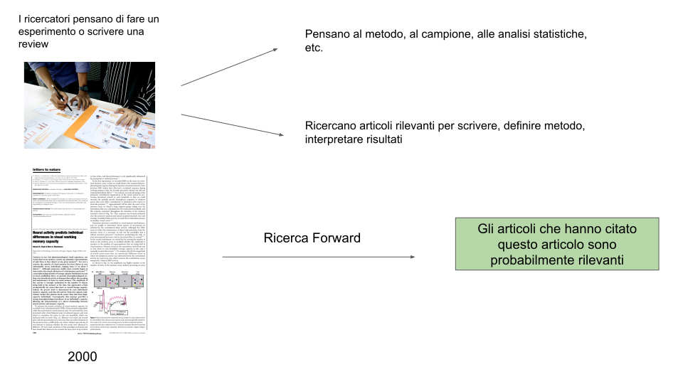

```{r setup, include=FALSE}
options(htmltools.dir.version = FALSE)
knitr::opts_chunk$set(echo = FALSE)
filename = stringr::str_replace(knitr::current_input(), ".Rmd", "")
```

# Ricerca Bibliografica

.pull-up[
La ricerca bibliografica consiste nel **ricercare informazioni** contenute in articoli, libri e risorse elettroniche che vengono pubblicate e delle quali si conoscono in modo più e meno chiaro le **fonti**.
]

.pull-down[
```{r, out.height=300, fig.align='center'}

```
]

---
class: section, center, middle

# Principali Tipologie di Pubblicazioni

---

# Rivista Scientifica

```{r out.height=200, fig.align='center'}

```

```{r, out.width=500, fig.align='center', out.height=220}

```
---

# Libri

 In particolare gli **handbooks**

.pull-left[
```{r, out.height= 350, out.width= 280}
knitr::include_graphics("img/handbook.jpg")
```
]
.pull-right[
```{r, out.height= 350, out.width= 280}
knitr::include_graphics("img/visualmemory.jpg")
```
]

---

# Risorse Elettroniche

[Scholarpedia](http://www.scholarpedia.org)


[Jove](https://www.jove.com/)

```{r, fig.align='center', out.width=300}
knitr::include_graphics("img/jove.jpg")
```

---
class: section, center, middle

# Dove trovare queste risorse?

---

# Come funziona la pubblicazione scientifica?

```{r}

```

---

# I database bibliografici

I database bibliografici sono dei motori di ricerca (simili a Google) ma che indicizzano solo pubblicazioni scientifiche. Rispetto a google hanno delle funzioni avanzate tipo:

- combinare parole chiave (vedremo dopo)
- filtrare per variabili sperimentali (età dei soggetti, strumenti utilizzati, etc.)
- filtrare per tipo di pubblicazione, autore, etc.

```{r, out.width="90%"}

```

---
class: section, center, middle

# Come accedere a queste risorse?

---

# Problematiche di accesso

* Le banche dati possono essere liberamente accessibili (non proprio tutte) ma spesso gli **articoli sono a pagamento**
* Noi non abbiamo gli abbonamenti alle riviste o alle banche dati quindi:

.pull-left[

```{r, out.height=250, out.width=300}
knitr::include_graphics("img/payarticle.png")
```

]

.pull-right[

```{r, fig.align='center'}
knitr::include_graphics("img/payarticle2.png")
```

]

---

# Servizio Proxy Unipd

Installazione molto semplice tramite [Auth-Proxy](https://bibliotecadigitale.cab.unipd.it/bd/auth-proxy). E' disponibile anche un'**estensione per Chrome/Firefox** per accendere e spegnere il servizio di proxy

```{r}

```

---

# Link Speciali delle Banche Dati

Oltre al servizio proxy il sistema bibliotecario di Padova offre diverse risorse e documenti come tutorial per accedere ai vari servizi

Ci sono nel portale [Galileo Discovery](http://bibliotecadigitale.cab.unipd.it/resourcefacetednavigation/#c9=S&b_start=0&c5=PSICOLOGIA) i vari link alle banche dati come **Scopus** e **Psychinfo**.

 Questi link che trovate sul sito sono particolari perchè permettono di accedere al servizio di banca dati (se avete attivato il proxy)

* **TIP** aggiungere come preferito il link che trovate nel sito, in modo da accedere senza tornare nel sito della biblioteca

---
class: section, center, middle

# I primi problemi 😭

---

# Non accesso agli articoli

Può succedere che nonostante il proxy non si riesca ad accedere agli articoli

# Soluzioni

1. [Google Scholar](https://scholar.google.it/)

2. [ResearchGate](https://www.researchgate.net/) (spesso link da Scholar)

3. [Unpaywall](https://unpaywall.org/)

4. Chiedere agli autori

 Danger!! ⚠️⚠️⚠️

* SciHub and LibGen (veeeery illegal ☠️)

---

# Google Scholar

```{r,fig.align='center'}

```

* Google Scholar è un **motore di ricerca gratuito** per le pubblicazioni scientifiche (non usare mai google normale!)

* E' un ottimo **punto di partenza per ricerche veloci**

* Non è adatto a ricerche sistematiche e raffinate

---

# Google Scholar

```{r,fig.align='center'}

```

* A parte le funzioni di ricerca (che vediamo dopo) permette di trovare facilmente i **full-text** degli articoli

* Ci sono delle funzioni di ricerca avanzate come gli **operatori booleani**, funzioni di **alert**, **sorting** per data e citazioni e i **profili degli autori**

---

# ResearchGate

```{r,fig.align='center'}
knitr::include_graphics("img/researchgate.png")
```

E' un **social network** per accademici dove si può seguire e interagire la ricerca di altre persone

Gli autori spesso **caricano i propri articoli** o si può facilmente **chiedere direttamente**

---

# SciHub


```{r,fig.align='center'}

```

* E' un servizio molto controverso ed in parte illegale (lo usano tutti) che permette di accedere a praticamente tutti gli articoli senza proxy ne abbonamenti vari

* Copiare e incollare il **link** dell'articolo o il **DOI** e avremo l'accesso!

---
class: section, center, middle

# I Metadati Bibliografici

---

# Metadati

I metadati sono quelle informazioni che permetto di **catagolare**, **risalire** e **riportare** le informazioni rispetto ad una *fonte bibliografica*

`Zhang, W., & Luck, S. J. (2008). Discrete Fixed-Resolution Representations in Visual Working Memory. Nature, 453(7192), 233–235. doi: 10.1038/nature06860`

* Autore
* Anno di pubblicazione
* Titolo
* Rivista
* Issue e Volume
* Pagine
* Digital Object Identifier (DOI)

---

# Riferimento Bibliografico

.pull-left[

```{r,fig.align='left'}

```
]

.pull-right[
</br>
</br>
#### Articolo + Metadati
Vanno a formare il riferimento bibliografico
]

---
class: section, center, middle

# Citazioni

---

# Citazioni

Le citazioni sono i **riferimenti** a specifiche fonti che vengono inseriti nel testo prodotto e che (dovrebbero) corrispondono alle **fonti selezionate e consultate**

#### Diverse tipologie

.pull-left[

Riferimento Numerico

```{r,fig.align='left'}

```

]

.pull-right[

Testo Completo

```{r,fig.align='left'}

```
]

---

# Stili Citazionali

Ci sono diversi [stili citazionali](https://en.wikipedia.org/wiki/Citation) spesso tipici di una disciplina o di una rivista scientifica.

* Per esempio lo stile **APA** è quello spesso usato in ambito psicologico

```{r,fig.align='center', out.width="20%"}

```

---

class: section, center, middle

# Come fare la ricerca bibliografica

---

# Elementi Importanti

1. Avere ben **chiaro l'argomento**

2. Definire le **parole chiave**

3. Scegliere il **Motore di Ricerca** (psychinfo, scopus, etc.)

4. Usare un **Software** di Gestione Bibliografica

5. **Leggere**, **catalogare** ed **estrarre** informazioni

    - partire da titolo e abstract
    - eventualmente leggere il full-text se rilevante
    - prendere note su quali articoli si sono letti, cosa c'è di importante e perchè

---

# Definizione dell'argomento

*  I motori di ricerca funzionano a parole chiave e le informazioni più rilevanti sono su **Titolo**, **Abstract** e **Keywords**

*  Cercare di **indentificare cosa interessa e cosa no** in modo da selezionare chiaramente gli articoli

*  Avere già una **scaletta** della tesi o dell'argomento generale è molto utile

*  Suddividere in **macro-argomenti** può essere utile sia per la ricerca che per la scrittura
  
---

# Keywords

 Le parole chiave sono quelle che **definiscono il vostro argomento**

#### Esempio:

**`La depressione in adolescenza`** 😱😱😱

```{r,fig.align='center'}

```

---

# Keywords

 Ovviamente argomenti troppo generici non possono essere gestiti

#### Esempio 2:

**`Conseguenze Scolastiche della Depressione in Adolescenza`** 

* Keyword 1: Scuola

* Keyword 2: Depressione

* Keyword 3: Adolescenza

---

# Keywords - Switch to English

 La ricerca in letteratura è solamente in Inglese, quindi è utile avere chiaro:

* Il **termine inglese** della vostra keyword

* L'eventuale **termine tecnico o maggiormente usato** nell'ambito di ricerca

* Utilizzare un [Thesaurus](https://www.thesaurus.com/) per sinonimi

#### Esempio, risultati scolastici:

<s> scholastic results </s>

**Scholastic/Academic/Educational Achievement**

---

# Boolean Operators

```{r,fig.align='center'}
knitr::include_graphics("img/boolean.svg")
```

</br>

* Per combinare le parole chiave nei motori di ricerca si usano gli **operatori booleani**

* Nel nostro esempio a noi interessano articoli su:

</br>

Adolescence **AND** Depression **AND** Academic Achievement

---

# Other Operators

Ci sono diversi e complessi modi di usare questi motori di ricerca tuttavia altre due funzioni generali sono fondamentali:

 **Ricerca Esatta**

Utilizzando le virgolette `""` si ricercano le parole nel modo in cui le abbiamo scritte. Ad esempio se cerchiamo:

* **Attachment Theory**: troviamo tutte gli articoli dove compare sia il termine **attachment** che **theory**

* "**Attachment Theory**": Articoli dove compare esattamente l'insieme di parole **attachment theory**

---

# Other Operators

**Wildcards**

Utilizzando le virgolette l'asterisco `*` possiamo omettere una parte di parola e quindi considerare tutte le possibili versioni

* Se cerchiamo **Child** abbiamo solo il termine child

* Se cerchiamo **Child*** cerchermo anche tutti i possibili completamenti come: **children, childhood, childs** etc.

---
class: section, center, middle

# Altre strategie e consigli per la ricerca

---

# Literature Reviews 😍😍😍

Quando dovete ceracre un argomento nuovo, cercate sempre una literature review o una meta-analisi:

- Permettono di avere una panoramica ragionata e recente (cercare sempre quelle più recenti) sull'argomento
- Sono una *porta di accesso* a molti articoli importanti (ricerca backward)
- Se meta-analisi vi forniscono una visione migliore di un certo argomento dal punto di vista statistico (molto meglio di qualsiasi singolo articolo)
- La parte narrativa (Introduzione - Discussione) è utile per inquadrare l'argomento ed anche stutturare un eventuale introduzione discussione
  
---

# Backward Research

La ricerca **backward** consiste nel ricercare attraverso la bibliografia di altri lavori

```{r,fig.align='center', out.height= 350}
knitr::include_graphics("img/backward.svg")
```

---

# Backward Research

* Trovare un lavoro **abbastanza recente** e di un autore conosciuto o rivista importante o una literature review/metanalisi

* **Usare la bibliografia** per selezionare i paper più rilevanti

* **Continuare a selezionare** basandosi a propria volta sulla bibliografia degli articoli stessi

---

# Forward Research

La ricerca **forward** consiste nel selezionare gli articoli che hanno citato un determinato articolo di partenza

```{r,fig.align='center', out.height= 350}

```

---

# Forward Research

* Il punto di partenza può essere un **lavoro famoso o comunque rilevante**, comunque non troppo citato (altrimenti troppo vaga).

* Deve essere comunque **abbastanza specifico** altrimenti coloro che lo hanno citato possono appartenere ad ambiti troppo diversi

* Google Scholar permette di **effettuare una nuova ricerca** sul pool di articoli che hanno citato un determinato lavoro

---
# Forward Research

```{r}

```

```{r}

```

---

# Terminologia altamente specifica

* Se la vostra ricerca comprende **termini molto tecnici** oppure molto specifici come **nomi di questionari** o **teorie** ovviamente sfruttateli nella ricerca

* Alcuni motori di ricerca (Psychinfo) permettono di **filtrare i risultati** in modo molto raffinato e specifico

```{r,fig.align='center', out.height= 350}

```

---
class: section, center, middle

# Salvare e Gestire la Bibliografia

---

# I metadati bibliografici

* I dati bibliografici sono contenuti in file dal formato specifico come `.bib`, `.txt` oppure `.ris`.
* Non sono altro che documenti di testo che determinati software leggono e automaticamente riconoscono tutte le informazioni
* Generalmente i software di gestione bibliografica estraggono queste informazioni direttamente dal file PDF dell'articolo oppure dal sito della rivista usando alcune estensioni per browser
* I database bibliografici permettono di esportare in massa tutti gli articoli che compongono una ricerca

```{r, fig.align='center', out.height= 300}

```

---
# Altre risorse

- Il sito della [biblioteca Metelli](http://bibliotecapsicologia.cab.unipd.it/) fornisce tutte le informazioni su come raggiungere, interrogare e gestire i risultati delle banche dati

- Sempre la biblioteca organizza dei [**corsi gratuiti**](http://bibliotecapsicologia.cab.unipd.it/usa-la-biblioteca/contenuti/laboratori-formazione) per fare la ricerca bibliografica e gestire i risultati

```{r}

```

---

# Altre risorse - Zotero

Per quanto riguarda la gestione bibliografica, la soluzione gratuita e più immediata è [**Zotero**](https://www.zotero.org/) (c'è di meglio ma a pagamento). Zotero permette di:

- salvare e organizzare gli articoli in cartelle
- mettere tag, note, sottolineare/evidenziare i pdf
- citare in automatico su Word e Google Docs

Qualche link utile:

- [video](https://www.youtube.com/watch?v=JG7Uq_JFDzE) tutorial 
- [documentazione](https://www.zotero.org/support/quick_start_guide) ufficiale

---
class: title-slide-final, middle, center, inverse

# Enjoy your bibliographic research 😎😎

<br/>
<br/>
.email[`r icons::fontawesome$solid$envelope` [filippo.gambarota@phd.unipd.it](mailto:filippo.gambarota@gmail.com)]
<br/>
<br/>
.social[`r icons::fontawesome$brands$twitter` [@fgambarota](https://twitter.com/fgambarota)]
<br/>
.social[`r icons::fontawesome$brands$github` [filippogambarota](https://github.com/filippogambarota)]
<br/>
<br/>

```{r, eval=params$pdf_button, results='asis', echo=FALSE}
glue::glue("[Download PDF slides]({file}.pdf)", file = filename)
```


