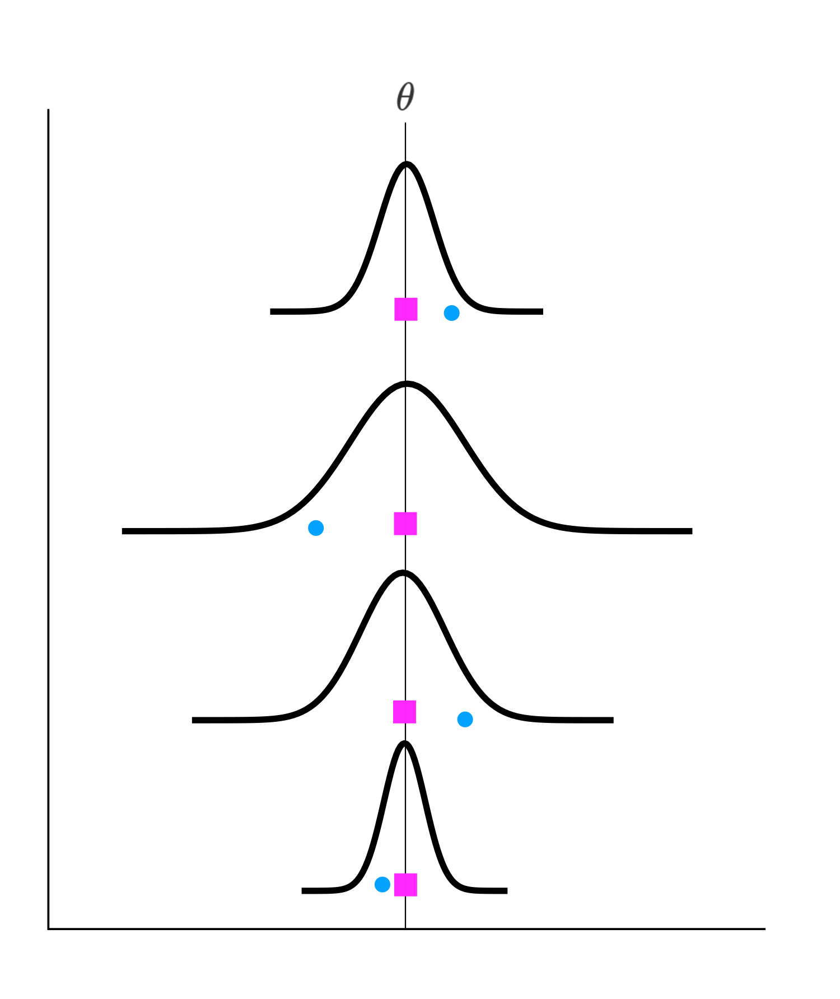

```{r setup, include=FALSE}
options(htmltools.dir.version = FALSE)
knitr::opts_chunk$set(echo = F,
                      fig.align = "center",
                      fig.retina = 2,
                      message = F,
                      warning = F)

# File name Setup

filename = stringr::str_replace(knitr::current_input(), ".Rmd", "")

# Packages

library(metafor)
library(kableExtra)
library(brms)
library(tidyverse)
library(gridExtra)
library(cowplot)
library(MASS)

```
class: inverse, center, middle

# Contents

---

# Contents

* ### General Intro
* ### Meta-analysis steps
  * Research question
  * Literature search
  * Extracting data
  * Effect Size computation
  * Effects Size standard error
* ### Fixed and Random-effect models
  * Model fitting
  * Reporting

---

class: inverse, center, middle

# General Intro

---

# General Intro

* ### A meta-analysis is a **quantitative** way to summarize research result about a specific topic, research question or research area.

* ### Shares the **systematic literature search** with narrative or systematic reviews

* ### Beyond "simply" quantifying a phenomenon, the meta-analysis can be considered as a **radiography** of the published literature

* ### Gives insights about holes in literature, could suggest new research topics or support a new experiment

---

# The Meta perspective

```{r}
knitr::include_graphics("img/multilevel-model.png")
```

.footnote[Source: [Doing meta-analysis in R](https://bookdown.org/MathiasHarrer/Doing_Meta_Analysis_in_R/mlma.html)]


---
class: inverse, center, middle

# Meta-analysis steps

---

# Research Question

* ### Not all topics can be managed using a meta-analytic approach
  * **Too broad**: *Efficacy of psychotherapy*
  * **Too narrow**: Not a problem, but probably a little amount of available papers

* ### *Mixing apple and oranges*
  * Does makes sense to pull together these *n* articles?

---

# Literature Search

.pull-left[

* ### This is a very crucial and complicated step
  * Keywords
  * Systematic research across *databases*
  * Ideally performed at least by **2 peoples**
  * A lot of guidelines such as the **PRISMA** approach
]

.pull-right[
```{r}
knitr::include_graphics("img/prisma.png")
```

]

---
# Extracting Data

* ### The first step towards the statistical modeling
* ### Extract relevant data in order to:
  * Compute **outcome** (e.g., effect size) measures
  * Select relevant **moderators** for the meta-regression
* ### These moderators need to be theoretically relevant and should be selected before starting the meta-analysis. At the same time exploratory analysis is perfectly fine.

---

# Effect Size Computation

The effect size is number that quantify the **strength of an effect** in the population that is estimated from our sample

```{r, fig.height=5, fig.width=8}

# Correlation

mu <- rep(0,2)
Sigma <- matrix(.7, nrow=2, ncol=2) + diag(2)*.3
rawvars <- mvrnorm(n=100, mu=mu, Sigma=Sigma)
cor_dat <- tibble(x = rawvars[,1], y = rawvars[,2])

cor_plot <- ggplot(cor_dat, aes(x = x, y = y)) +
    geom_point() +
    theme_minimal_grid() +
    geom_smooth(method = "lm", se = F) +
    ggtitle(paste("Correlation", round(cor(cor_dat$x,cor_dat$y), 2)))

# Mean difference

m1 = 100
m2 = 120
s = 50

d_dat <- tibble(g1 = rnorm(10, m1, s),
                g2 = rnorm(10, m2, s)) %>% 
    pivot_longer(1:2, names_to = "group", values_to = "value")

d_plot <- ggplot(d_dat, aes(x = group, y = value)) +
    geom_point(alpha = 0.2) +
    geom_pointrange(data = d_dat %>% 
                        group_by(group) %>% 
                        summarise(mean_se(value)),
                    aes(x = group, y = y, ymin = ymin, ymax = ymax),
                    size = 1) +
    theme_minimal_grid() +
    ggtitle(paste("Cohen's d = ", round(lsr::cohensD(value ~ group, data = d_dat), 2)))

cowplot::plot_grid(cor_plot, d_plot, align = "hv")

```

---

# Effect Size Computation

.pull-left[

### Correlation

$$r =\frac{ \sum_{i=1}^{n}(x_i-\bar{x})(y_i-\bar{y})}{\sqrt{\sum_{i=1}^{n}(x_i-\bar{x})^2}\sqrt{\sum_{i=1}^{n}(y_i-\bar{y})^2}}$$

]

.pull-left[

### Standardized Mean Difference (e.g., Cohen's $d$)

$$d = \frac{M_1 - M_2}{SD_{pooled}}$$
]

---

# Effect Size Standard Error

In statistics, every population parameter estimation has an associated uncertainty measure: **Standard Error**. Given that our sample size is always a subset of the population, our estimation is not perfect.

Example: estimation of the males height in Italy

* $\theta$ = real population height (175cm; but unknown in real research)
* We took a sample $S$ of size $n$, with observed mean $\bar{X}$ and standard deviation $s$
* From statistical theory we know that $\bar{X}$ is a good estimator of $\theta$ but with a given uncertainty:

$$SE = \frac{s}{\sqrt{n}}$$
---

# Effect Size Standard Error

.pull-left[

* The estimated mean is the same but the **uncertainty vary as a function of sample size**
* A study with an **higher sample size** has a **greater estimation precision**

]

.pull-right[
```{r}
m = 175
s = 10

n = c(10, 50, 100, 1000)

dat <- map(n, function(x) replicate(1000, expr = {mean(rnorm(x, m, s))}))

names(dat) <- n

bind_rows(dat) %>% 
    pivot_longer(1:4, names_to = "sample_size", values_to = "value") %>% 
    mutate(sample_size = as.integer(sample_size)) %>% 
    ggplot(aes(x = value)) +
    geom_histogram(bins = 40, col = "black", fill = "lightblue") +
    facet_wrap(~sample_size) +
    theme_minimal_grid()
```
]

---

# Quick Recap

### We have:

  * Defined our research question
  * Found relevant literature
  * Gathered important data
  * For each study:
    * Outcome measure
    * Measure uncertainty (i.e., Standard Error)

---

class: inverse, center, middle

# Meta-analysis models

---

# Meta-analysis models

* ### The basic meta-analytic model can be considered a weighted average where all information is combined giving **more weight** to **more precise** studies
* ### From a linear regression point of view, is the simplest model (aka null model) where only the (weighted) mean is estimated
* ### Two main meta-analytic models:
  * Fixed-effect or Equal effect model 
  * Random-effect model

---

# Equal-effect model

```{r, out.height=500}

```

---

# Equal-effect model

.pull-left[

Model:

$$y_i = \theta + \epsilon_i$$

$$\epsilon_i \sim Normal(0, v_i)$$

$$\hat{\theta} = \frac{\sum{w_iy_i}}{\sum{w_i}}$$
$$w_i = \frac{1}{v_i}$$
]

.pull-right[

* Weighted average where the weight is the inverse of the study precision (i.e., inverse variance weight)
* More precision = more weight

]

---

# Equal-effect model

### The statistical assumption: the **true** (latent) effect is fixed and observed variability is due to different study precision

* Only 1 parameter to estimate and the associated standard error
* No real between-study variability
* Each study is considered like a replication of the same effect
* Meta-regression is not considered --> no variability to explain

### Often (in psychology) not appropriate!!

---

# Random-effect Model

```{r, out.height=500}
knitr::include_graphics("img/random_effect.svg")
```

---

# Random-effect Model

.pull-left[

Model:

$$y_i = \mu + \theta_i + \epsilon_i$$

$$\theta_i \sim Normal(0, \tau)$$

$$\hat{\mu} = \frac{\sum{w_iy_i}}{\sum{w_i}}$$
$$w_i = \frac{1}{v_i + \hat{\tau}}$$
]

.pull-right[

* Weighted average where the weight is the inverse of the study precision (i.e., inverse variance weight) and the between-study heterogeneity
* More precision = more weight BUT extreme studies (very low/high precison) are smoothed in terms of final weight

]

---

# Equal-effect model

### The statistical assumption: the **true** (latent) effect is fixed and observed variability is due to different study precision

* Given that we are estimating a distribution of effect and not a single value:
  * Estimation of $\mu$
  * Estimation of $\tau$
* $\tau$ is the between-study heterogeneity that can be explained using moderators

---
# Fixed vs Random-effect model

## Important!

### These two models are not estimating the same quantity from both the statistical and theoretical point of view:
* **Fixed-effect model**: We are estimating the **true underlying effect**
* **Random-effect model**: We are estimating the **true average effect** along the effect variability. The same effect, under specific conditions could be higher or lower/absent

---
class: inverse, center, middle

# Practical Example

---
# Analysis Steps

- ### Effect size computation
- ### Model fitting
  - Model diagnostic
  - Parameters Intepretation
  - Forest Plot
- ### Publication Bias
- ### Meta-regression

---

# Data

```{r}

massage <- read.table("data_massage.txt", header = T)

massage %>% 
  dplyr::select(study, minutes, yi, vi) %>%
  slice(1:10) %>% 
  kable() %>% 
  kable_styling()

```

---
# Data

```{r}
massage$sei <- sqrt(massage$vi)
massage %>% 
    ggplot(aes(x = yi, y = study)) +
    geom_vline(xintercept = 0, linetype = "dashed", size = 1, col = "red") +
    geom_pointrange(aes(x = yi, y = study, xmin = yi - sei*1.96, xmax = yi + sei*1.96),
                    fatten = 0.1, col = "grey", size = 1) +
    geom_point(aes(col = stat(ifelse(x < 0, "1", "2")), size = 1/sei)) +
    scale_color_manual(values = c("red", "black")) +
    theme_minimal_hgrid() +
    theme(legend.position = "none")
```

---
# Model - Metafor

```{r}
library(metafor)
```

### Fixed Effect Model

```{r, echo = T}
fit.fe <- rma(yi, vi, method = "FE", data = massage)
```

### Random Effect Model

```{r, echo=T}
fit.re <- rma(yi, vi, method = "REML", data = massage)
```

---
# Fixed Effect

```{r}
fit.fe
```

---

# Random Effect

```{r}
fit.re
```

---
# Forest Plot

```{r}
forest(fit.re)
```

---
# Publication Bias

### Published articles are only a (biased) subset of the research conducted on a particular phenomenon
* Only "significant" results are published
* Replication studies are not catchy

### Approaches to Publication Bias
* Graphical evaluation
* Test for the presence of publication bias
* Effect size correction

---
# Publication Bias - Funnel Plot

```{r}
funnel(fit.re)
```

---
# Publication Bias - Funnel Plot

```{r, out.height=500}
knitr::include_graphics("img/funnel.jpg")
```

---
# Meta-regression

```{r}
massage %>% 
    ggplot(aes(x = yi, y = minutes)) +
    geom_smooth(method = "lm", se = F) +
    geom_point(aes(size = 1/sei)) +
    theme_minimal() +
    theme(legend.position = "none")
```

---
# Meta-regression

### The impact of **minutes** on the estimated effect size:

```{r, echo=TRUE}
fit.meta <- rma(yi, vi, method = "REML", data = massage,
                mods = ~minutes)
```

---
# Meta-regression

```{r}
fit.meta
```

---
class: inverse, center, middle

# Final considerations

---
# Final considerations

* ### We know the average effect of interest
* ### We know which moderators explain our effect variance
* ### We know which effect we should expect for a future study (i.e., power analysis)
* ### We know the literature structure about our phenomenon:
  * missing studies?
  * future studies?

---

class: inverse, center, middle

# What else?

---
# What else?

* ### Bayesian meta-analysis
* ### More complex models (multilevel, multivariate)
* ### Effect size calculation from computed statistics, p-values, etc.
* ### Diagnostic: outliers, influential points
* ### Power of meta-analysis

---
class: inverse, center, middle

# Some Materials

---
# Some Materials

* ### [notion.so/filippogambarota/Meta-analysis](https://www.notion.so/filippogambarota/Meta-analysis-5c503baa375a4fdeacd1f9685dc14888)

* ### [Metafor Website](https://www.metafor-project.org/doku.php)

* ### [Wolfgang Viechtbauer Course](https://www.wvbauer.com/doku.php/course_ma)

* ### [Doing Meta-analysis in R](https://bookdown.org/MathiasHarrer/Doing_Meta_Analysis_in_R/)

---
class: inverse, center, middle

<br/>

### .large[[filippo.gambarota@phd.unipd.it](mailto:filippo.gambarota@phd.unipd.it)]

`r icon::fontawesome("twitter")` [@fgambarota](https://twitter.com/fgambarota)  

`r icon::fontawesome("github")` [filippogambarota](https://github.com/filippogambarota)

<br/>

```{r, eval=params$pdf_button, results='asis', echo=FALSE}
glue::glue(".tiny[[Download PDF slides]({file}.pdf)]", file = filename)
```


```{r echo=FALSE, out.width=350}
knitr::include_graphics("img/final_logo.svg")
```

.tiny[Slides made with the [Xaringan](https://github.com/yihui/xaringan) package by [Yihui Xie](https://yihui.name/)]
