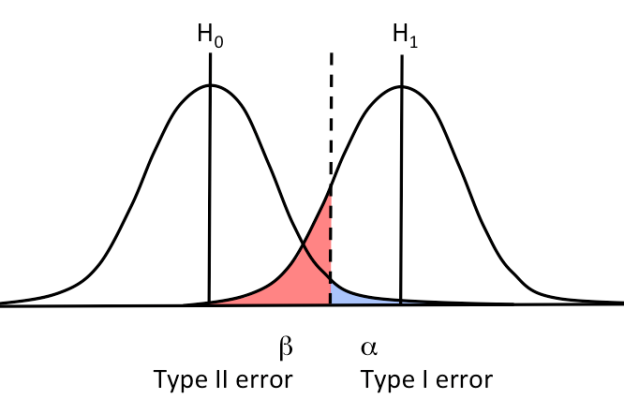

```{r setup, include=FALSE}
options(htmltools.dir.version = FALSE)
knitr::opts_chunk$set(echo = TRUE, 
                      fig.align = "center", 
                      fig.retina = 2, 
                      message = FALSE, 
                      warning = FALSE,
                      fig.width = 5,
                      fig.height = 5)
```

```{r packages, include=FALSE}
library(tidyverse)
```

```{r loading, include = FALSE}
sim <- read_rds("sim.rds")
```

# Power Analysis

The Power analysis is a way to estimate the effectiveness of our research design of **finding an effect when it is present**

```{r, echo=FALSE, out.width = "80%"}

```

---

# Power Analysis

For simple design like `t-test`, `proportions` and `anova` the power can be computed *analytically*, for more complex design we need to use a *simulation approach*:

- Assume the data generation process
- Create a grid of relevant values (effect size, sample size, number of trials, etc.)
- Simulate data a lot of times (e.g., 10000)
- Count the number of times that the `p-value` or the `bayes factor` is belowe/above a certain threshold

---

# Power analysis

Usually using *Gpower* we think that the power is a *single number* but in fact is a **function** with free and fixed parameters:

<br/>
<br/>
<br/>

$$
Power \sim sample\;size,\; effect \;size, \alpha
$$

---
# Power as a function

For this reason is better to always see the **power curve**:

```{r}
plot(pwr::pwr.t.test(d = 0.3, power = 0.80))
```

---
# Type of Power analysis

- A priori
<br/>
- A posteriori
<br/>
- Sensitivty analysis
<br/>
- ...

---
# A priori

We fix the power level (e.g., 80%), the effect size and the sample size is a free parameter:

```{r}
plot(pwr::pwr.t.test(d = 0.3, power = 0.80))
```

---
# A posteriori

Not very useful but is the same approach as before but also the sample size is fixed, so we find only one value in the function:

```{r}
plot(pwr::pwr.t.test(d = 0.3, n = 30))
```

---
# Sensitivity Analysis

- This approach consider the *effect size* as a free parameters while fixing the *power level* and the *sample size*.
- The idea is to find the *minimum detectable effect size* for a certain design
- If the *minimum detectable effect size* is too low can be worthless doing the experiment

---
# Sensitivity Analysis - t test

We can create a grid of values and simulate the power:

```{r, eval = FALSE}
m1 <- 0.3
nsim <- 1000

sim <- expand_grid(
  sample_size = seq(10, 300, 5),
  d = seq(0, 1, 0.1),
  nsim = 1:nsim
)

get_p <- function(sample_size, d){
  g1 <- rnorm(sample_size, d, 1)
  g0 <- rnorm(sample_size, 0, 1)
  t.test(g1, g0)$p.value
}

sim <- sim %>% 
  mutate(p_value = map2_dbl(sample_size, d, get_p))
```

---
# Sensitivity Analysis - t test

```{r, echo=FALSE, fig.width=8, fig.height=8}
sim <- sim %>% 
  group_by(sample_size, d) %>% 
  summarise(power = mean(ifelse(p_value < 0.05, 1, 0))) %>% 
  ungroup() 

sim %>% 
  filter(d < 0.6 & sample_size < 250) %>% 
  ggplot(aes(x = sample_size, y = d, z = power)) +
  stat_contour_filled() +
  cowplot::theme_minimal_grid() +
  coord_equal(ratio = 500)
```

---

# Sensitivity Analysis - t test

In a real scenario we have a fixed *n*, for example 30:

```{r, echo=FALSE}
sim %>% 
  filter(sample_size == 30) %>% 
  ggplot(aes(x = d, y = power)) +
  geom_point(size = 3) +
  geom_line() +
  geom_hline(yintercept = 0.8, col = "red", linetype = "dashed") +
  cowplot::theme_minimal_grid()
```

---

# Sensitivity Analysis

```{r, echo = FALSE}
m1 <- 0.3

d_sim <- map_dbl(1:10000, function(x){
  g1 <- rnorm(30, m1, 1)
  g0 <- rnorm(30, 0, 1)
  lsr::cohensD(g1, g0)
})
```

We can use the sensitivity analysis instead of the power analysis to report the minimum effect that we can detect with out resources. Is not perfect but reasonable (more than a posteriori power analysis). If we simulate a real $d$ of 0.3 and a sample size of 30. The proportion of effects greater than the *true* effect is `r mean(d_sim > 0.3)`

```{r, echo = FALSE}
d_sim %>%  
  tibble() %>% 
  mutate(over = ifelse(d_sim > 0.3, 1, 0)) %>% 
  ggplot() +
  geom_histogram(aes(x = d_sim, fill = d_sim > 0.3), color = "black", bins = 40) +
  cowplot::theme_minimal_grid() +
  theme(legend.position = "none")
```

---
# Resources

- [`simr`](https://cran.r-project.org/web/packages/simr/index.html) package
- [`pwr`](https://cran.r-project.org/web/packages/pwr/index.html) package
- Lakens & Caldwell ([2021](https://journals.sagepub.com/doi/full/10.1177/2515245920951503)) - Simulation-Based Power Analysis for Factorial Analysis of Variance Designs