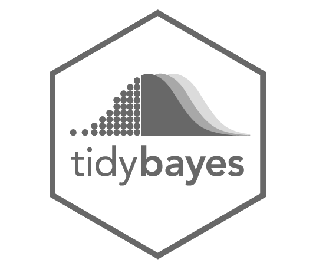
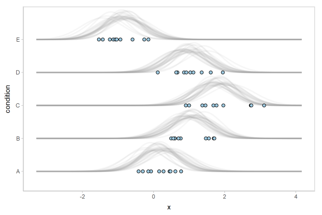

```{r setup, include=FALSE}
options(htmltools.dir.version = FALSE)
knitr::opts_chunk$set(echo = T, fig.align = "center")

# File name Setup

filename = stringr::str_replace(knitr::current_input(), ".Rmd", "")

# Packages

library(tidyverse)
library(broom)
```

# Contents

* ### What is the **tidyverse** and the **tidy approach**

* ### The main packages and function

* ### Other **tidy** packages

* ### Some examples

---
class: inverse, middle, center

# What is the Tidyverse?

---

# Tidyverse

.pull-left[
```{r, fig.cap="Hadley Wickham - RStudio Data Scientist", echo = F}
knitr::include_graphics("img/hadley-wickham.jpg")
```

]
.pull-right[
* The tidyverse is an opinionated collection of R packages designed for data science. All packages **share an underlying design philosophy, grammar, and data structures**

```{r, echo=FALSE, out.height=300, fig.align='center'}
knitr::include_graphics("img/tidyverse.svg")
```

]

---

# The big picture

```{r, echo=FALSE, fig.align='center'}
knitr::include_graphics("img/big_picture.png")
```

---

class: inverse, middle, center

# What is the Tidy approach?

---

# What is the tidy approach?

* ## The best way to format data is the **long format**

<br>

* ## Concatenate operations with **pipes**

<br>

* ## Focus on a **functional programming approach**

---

# Long-format data

```{r, include=FALSE}
dat <- expand_grid(
    id = 1:10,
    cond = c("A", "B", "C")
)

dat$cov <- rnorm(nrow(dat))
```


* ### Each row is an **observation** and each column is a **variable**

.pull-left[

```{r echo=FALSE}
dat %>% 
  pivot_wider(names_from = cond, values_from = cov) %>% 
  head()
```
]

--
.pull-right[

```{r, echo=F}
head(dat)
```

]

---

# Concatenate operations with **pipes**

.pull-left[
```{r, out.width=200, fig.align="center", echo=FALSE}
knitr::include_graphics("img/magrittr.png")
```
]

.pull-right[

* Pipes are some operators from the `magrittr::` package with the aim of **improving the code readability and maintainability** <sup>1</sup>

* There are several different **pipes** but the most used (and useful) is the `%>%`

* Pipes are integrated with all **tidyverse** functions and packages

]

.footnote[[1] [magrittr website](https://cran.r-project.org/web/packages/magrittr/vignettes/magrittr.html)
]

---

# Concatenate operations with **pipes**

* The `%>%` pipe is another way to **declare the function with an argument**

* If `.f` is a function and `.x` is an object, this `.f(x)` is equivalent to `.x %>% .f`

--

```{r}
mean(iris$Sepal.Length)
```

--

```{r}
iris$Sepal.Length %>% 
  mean()
```

---

# Concatenate operations with **pipes**

```{r, include = F, echo=FALSE}
dat <- expand_grid(
    id = 1:10,
    cond1 = c("A", "B", "C"),
    cond2 = c("1", "2", "3")
)

dat$value <- rnorm(nrow(dat), 100, 10)
dat$cov1 <- rep(rnorm(10), each = 9)
dat$cov2 <- rep(rnorm(10), each = 9)
```

The previous simple example is not completely appropriate, the `pipe` is useless. However let's assume a more complicated example:

--

```{r}
head(dat)
```

--

1. aggregate data by a `factor` using the `mean()` 
2. create a new columns with some operations between columns
3. rename a variable

---
# Without pipes and tidyverse

```{r}
dat <- aggregate(value ~ id + cond1 + cov1 + cov2, mean, data = dat) # aggregate by cond1
dat$cov1 <- dat$cov1 - mean(dat$cov1) # center
dat$cov2 <- (dat$cov2 - mean(dat$cov2))/sd(dat$cov2) # z point
names(dat)[1] <- "subject" # rename
head(dat)
```

--

* This works fine but is a little bit **redundant**, **difficult to read** and there is a **series of assignment operations**

* Some columns are not in the correct order

* In order to have a new `dat`, you can create a `dat_agg` or overwrite the `dat` object

---

# With pipes and tidyverse

```{r, include = F, echo=FALSE}
dat <- expand_grid(
    id = 1:10,
    cond1 = c("A", "B", "C"),
    cond2 = c("1", "2", "3")
)

dat$value <- rnorm(nrow(dat), 100, 10)
dat$cov1 <- rep(rnorm(10), each = 9)
dat$cov2 <- rep(rnorm(10), each = 9)
```


```{r}
dat %>% 
  mutate(cov1 = cov1 - mean(cov1),
         cov2 = (cov2 - mean(cov2))/sd(cov2)) %>% 
  rename("subject" = id) %>% 
  group_by(subject, cond1, cov1, cov2) %>% 
  summarise(mean = mean(value),
            sd = sd(value)) %>% 
  ungroup() %>% 
  head()
```

---

# With pipes and tidyverse

```{r, eval = F}
dat %>% 
  mutate(cov1 = cov1 - mean(cov1),
         cov2 = (cov2 - mean(cov2))/sd(cov2)) %>% 
  rename("subject" = id) %>% 
  group_by(subject, cond1, cov1, cov2) %>% 
  summarise(mean = mean(value),
            sd = sd(value)) %>% 
  ungroup() %>% 
  head()
```

* The `dat` object is not modified

* Operations follows an **easy to read workflow of operations**

* If you want to assign you can use `<-` at the beginning as `dat <- dat %>% ...`

---

# Functional Programming

Without technical details, the idea of functional programming is the comparison between a `for loop` and a `apply family` function <sup>2</sup>

.footnote[[2] From the Hadley Wickam talk - [Managing many models with R](https://www.youtube.com/watch?v=rz3_FDVt9eg)
]

--

```{r, eval = F}
means <- vector("double", ncol(mtcars))
medians <- vector("double", ncol(mtcars))

for(i in seq_along(mtcars)) {
    means[[i]] <- mean(mtcars[[i]], na.rm = TRUE)
    medians[[i]] <- median(mtcars[[i]], na.rm = TRUE)
}
```

--

```{r, eval = F}
means <- lapply(mtcars, function(x) mean(x))
median <- lapply(mtcars, function(x) median(x))
```

---

# Functional Programming with purrr::

.pull-left[
```{r, out.width=200, fig.align="center", echo=FALSE}
knitr::include_graphics("img/purrr.svg")
```

```{r, out.width=200, fig.align="center", echo=FALSE}
knitr::include_graphics("img/furrr.svg")
```
]

.pull-right[

* Purrr is as package that provides a series of **apply like** functions in order to perform complex and fast operations

* Furrr is the same package as `purrr` but with a `future` implementation in order to parallelize the operations

```{r}
means <- map_dbl(mtcars, mean)
means[1:4]

# sapply(mtcars, function(x) mean(x))
```
]

---

class: inverse, middle, center

# Main packages and functions

---

# Main packages and functions

```{r, echo=FALSE, fig.align='center'}
knitr::include_graphics("img/big_picture_high.png")
```

---

# Tidyr

.pull-left[
```{r, echo=FALSE, fig.align='center', out.width=500}
knitr::include_graphics("img/tidyr.svg")
```
]

.pull-right[

* Manipulate datasets to have **tidy** data

* Main functions are `pivot_longer()`, `pivot_wider`, and `separate()`

* Other functions like `drop_na()` and `nest()`

]

---

## Pivoting datasets

### From long to wide dataset

```{r}
dat %>% 
  head()
```

---

# Tidyr::pivot_wider()

From long to wide dataset

```{r}
dat %>% 
  pivot_wider(names_from = c(cond1, cond2), values_from = value) %>%
  head()
```

---

# Tidyr::pivot_longer()

From wide to long dataset

```{r}
dat %>% 
  pivot_wider(names_from = c(cond1, cond2), values_from = value) %>% 
  pivot_longer(4:12, names_to = "cond", values_to = "value") %>% 
  head()
```

---

# Tidyr::separate()

Separate a column in multiple columns considering a pattern

```{r}
dat %>% 
  pivot_wider(names_from = c(cond1, cond2), values_from = value) %>% 
  pivot_longer(4:12, names_to = "cond", values_to = "value") %>% 
  separate(cond, into = c("cond1", "cond2"), sep = "_") %>% 
  head()
```

---

# Dplyr

.pull-left[
```{r, echo=FALSE, fig.align='center', out.width=400}
knitr::include_graphics("img/dplyr.svg")
```
]

.pull-right[

* This is a very comprehensive package with several functions to create new columns, aggregate datasets, select rows, etc.

* `mutate()` adds new variables that are functions of existing variables
* `select()` picks variables based on their names.
* `filter()` picks cases based on their values.
* `summarise()` reduces multiple values down to a single summary.
* `arrange()` changes the ordering of the rows.

]

---

# Dplyr::mutate()

Create new columns with complex operations and functions

```{r, eval = F}
dat %>% 
  mutate(new_col = some_functions(other_col))
```

```{r}
dat %>% 
  mutate(new_col = cov1 * cov2) %>% 
  head()
```

---

# Dplyr::select()

Select columns in a more readable way

```{r}
dat %>% 
  pivot_wider(names_from = c(cond1, cond2), values_from = value) %>% 
  select(id, starts_with("A"), ends_with("3")) %>% 
  head()
```

---

# Dplyr::filter()

Select rows with multiple conditions

```{r}
dat %>% 
  filter(cond1 == "A" & cond2 == 2) %>% 
  head()
```

---

# Dplyr::arrange()

Reorder rows based on multiple columns

```{r}
dat %>% 
  group_by(cond1, cond2) %>% 
  summarise(mean = mean(value),
            sd = sd(value)) %>% 
  arrange(cond1) %>% 
  head()
```

---

# Dplyr::case_when()

Is an extension of a `ifelse()` statement in a more compact way

```{r}
dat %>% 
  mutate(new_fac = case_when(value > 100 & cond1 == "A" ~ "level1",
                             value < 50 & cond2 == 2 ~ "level2",
                             value != 100 & cond2 == 1 & cov1 > 0.5 ~ "level3",
                             TRUE ~ "level4")) %>% 
  head()
```

---

# GGplot2

.pull-left[
```{r, echo=FALSE, fig.align='center', out.width=300}
knitr::include_graphics("img/ggplot2.svg")
```
]

.pull-right[

* Easy to integrate with workflow and pipelines

* Lack of `%>%` functions <sup>3</sup>

* Amazing way to combine different layers of plot components

]

.footnote[[3] Hadley Wickam [talk](https://www.youtube.com/watch?v=vYwXMnC03I4&t=2203s) about "mistakes" in developing the tidyverse
]

---

# GGplot2

```{r, fig.align="center", out.height=400}
dat %>% 
  select(cov1, cov2) %>% 
  ggplot(aes(x = cov1, y = cov2)) +
  geom_point()
```

---

# Broom

.pull-left[
```{r, echo=FALSE, fig.align='center', out.width=300}
knitr::include_graphics("img/broom.svg")
```
]

.pull-right[

* Manipulate **fitted models** and return **tidy data**

* Very useful for extracting information from multiple models in a easy way

* There are some expansions like `broom mixed` for `lme4` objects and `broomExtra` for also `brms` models

]

---

# Broom::tidy() and Broom::glance()

```{r}
fit <- lm(value ~ cond1 * cond2 + cov1 + cov2, data = dat)
tidy(fit) %>%  head()
glance(fit)
```

---

# Other packages

.pull-left[

### Strings manipulation

```{r, echo=F, out.width=250}
knitr::include_graphics("img/stringr.svg")
```
]

.pull-right[

### Work with dates

```{r, echo=F, out.width=250}
knitr::include_graphics("img/lubridate.svg")
```
]

---

# Other packages

.pull-left[

### Datatable power, dyplr code

```{r, echo=F, out.width=500}
knitr::include_graphics("img/dtplyr.svg")
```
]

.pull-right[

### Modelling (e.g., broom)

```{r, echo=F, out.width=250}
knitr::include_graphics("img/tidymodels.svg")
```
]

---

# Other packages

.pull-left[

### Tidybayes

```{r, echo=F, out.width=400}

```
]

.pull-right[

* Some **geoms** for `ggplo2` and function to manage fitted **bayesian models**

* Support `rstanarm`, `brms`

```{r, fig.align="center", echo=F, out.width=600}

```

]

---

# Some Resources

## R4DS - R for Data Science

.pull-left[
```{r, echo = F, fig.align="center", out.width=200}
knitr::include_graphics("img/r4ds.jpg")
```
]

.pull-right[

* Best book for the **tidy** approach the **data science** in general

</br>

* Especially the [many models](https://r4ds.had.co.nz/many-models.html) chapter

]

.footnote[[R4DS Book](https://r4ds.had.co.nz/)]

---

# Talks

* [David Robinson - Ten Tremendous Tricks in the Tidyverse](https://www.youtube.com/watch?v=NDHSBUN_rVU)

* [David Robinson - Teach the Tidyverse to Beginners](https://www.youtube.com/watch?v=dT5A0sAWc2I)

* [Hadley Wickham - Managing many models with R](https://www.youtube.com/watch?v=rz3_FDVt9eg&t)

* [Hadley Wickham - Mistakes of the Tidyverse](https://www.youtube.com/watch?v=vYwXMnC03I4&t)

* [Hadley Wickham - Data visualization and data science](https://www.youtube.com/watch?v=9YTNYT1maa4&t)

* [Emily Robinson - The lesser known stars of the Tidyverse](https://www.youtube.com/watch?v=ax4LXQ5t38k)

---

class: inverse, center, middle

<br/>
<br/>

### .large[[filippo.gambarota@phd.unipd.it](mailto:filippo.gambarota@phd.unipd.it)]

<br/>

```{r, eval=params$pdf_button, results='asis', echo=FALSE}
glue::glue("[Download PDF slides]({file}.pdf)", file = filename)
```

<br/>

.tiny[Slides made with the [Xaringan](https://github.com/yihui/xaringan) package by [Yihui Xie](https://yihui.name/)]

```{r echo=FALSE, out.width=450}
knitr::include_graphics("img/final_logo.svg")
```