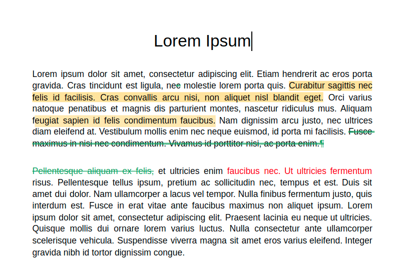
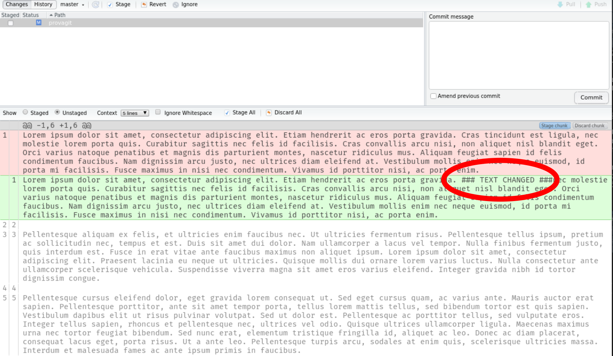

```{r setup, include=FALSE}
options(htmltools.dir.version = FALSE)
knitr::opts_chunk$set(echo = F, 
                      fig.align = "center")

# Functions

make_text <- function(text, size){
    out <- sprintf("<p style='font-size:%spx'>%s</p>", size, as.character(text))
    return(noquote(out))
}

make_href <- function(text, link){
    out <- sprintf("<a href='%s'> %s </a>", link, text)
    return(noquote(out))
}
```

class: title-slide

```{r, out.width="30%"}
knitr::include_graphics("img/trackdown_logo.png")
```

.logo-conf[
```{r, out.width="50%"}

```
]

# An R package for collaborative writing and editing

### @SIPS 2021

---
class: chapter-slide, center, middle

# Let's start from a normal academic day...

---

# Writing

.pull-left[

```{r, out.extra='style="border: none;"'}
knitr::include_url("https://giphy.com/embed/LGWYfM9Dd7Kuc")
```

]

--

.pull-right[

* Writing bibliography

<br/>

* Copy and paste statistics and results `r emo::ji("scream")`

<br/>

* Tables and figures `r emo::ji("scream")`

<br/>

* Collaboration

]

---

class: chapter-slide, center, middle

# Literate programming in R

---

class: fullscreen

```{r, out.extra='style="border: none;"'}
knitr::include_url("https://rmarkdown.rstudio.com/index.html", height = 600)
```

---

# Amazing packages for different kinds of documents

```{r}
knitr::include_graphics("img/literate_hex.svg")
```

---

class: center

# What about collaboration?

--

```{r, out.extra='style="border: none;"'}
knitr::include_url("https://giphy.com/embed/6ZaYjk1qC1Tby")
```

---

# Why?

.pull-left[

* We have to collaborate with people with different backgrounds

* We have to collaborate on **plain text files** (`.Rmd` or `.Rnw`) so before the compilation stage

* We **lack of a collaborative environment** for text-based documents such as the revision mode of Microsoft Word or Google Docs

]

--

.pull-right[

```{r, out.extra='style="border: none;"'}
knitr::include_url("https://giphy.com/embed/xU9TT471DTGJq")
```
]

---
class: chapter-slide, centre, middle

# Wait! we have GIT for collaboration on plain text files! 😎

---

# GIT is powerful! but not for text-based documents! `r emo::ji("sad")`

--

.pull-left[

```{r, fig.cap="With standard reviewing tools", out.height="350"}

```

]

--

.pull-right[

```{r, fig.cap="Using GIT", out.height="350"}

```

]

---

class: chapter-slide, center, middle

# In an ideal world...

---

## We need a tool that:

--

* Allow us to easily **collaborate in the same way as a standard Word file**

<br/>

--
* Is **user friendly** for the average user and **powerful** for experts

<br/>

--
* **Keep all amazing features of a literate programming framework**, without any compromises

--

```{r, out.extra='style="border: none;"'}
knitr::include_url("https://giphy.com/embed/EldfH1VJdbrwY", height = 200)
```

---
class: center, middle

# This is the main aim of the trackdown package 😎

```{r, out.width="30%"}
knitr::include_graphics("img/trackdown_logo.png")
```
---
class: chapter-slide, center, middle

# The big picture

---
# The big picture

```{r}
knitr::include_graphics("img/workflow.svg")
```

---

class: chapter-slide, center, middle

# trackdown::upload_file()

---
class: fullscreen

<!---
Thanks to Andy Field https://stackoverflow.com/questions/32823436/auto-full-screen-iframe-video-without-using-any-api
-->

<video width="100%" height="100%" controls id="my_video">
    <source src="video/out/upload_and_googledrive_cut.mp4" type="video/mp4">
</video>

---

class: chapter-slide, center, middle

# Awesome collaboration on Google Docs

---
class: fullscreen

<video width="100%" height="100%" controls id="my_video">
    <source src="video/out/review_process_cut.mp4" type="video/mp4">
</video>

---

class: chapter-slide, center, middle

# trackdown::download_file()

---
class: fullscreen

<video width="100%" height="100%" controls id="my_video">
    <source src="video/out/download_file_cut.mp4" type="video/mp4">
</video>

---
class: fullscreen

# Check the full documentation `r emo::ji("smile")`

[**ekothe/trackdown**](https://ekothe.github.io/trackdown/) `r icons::fontawesome("github")`

```{r out.extra='style="border: none;"'}
knitr::include_url("https://ekothe.github.io/trackdown")
```

---
class: split-five, fullscreen

# The developers 😎

```{r, include = FALSE, echo=FALSE}

# Creating names and affiliations

devs <- c("Filippo Gambarota", "Claudio Zandonella Callegher", "Janosch Linkersdörfer", "Mathew Ling", "Emily Kothe")
emails <- paste0("mailto:", c("filippo.gambarota@phd.unipd.it", "claudiozandonella@gmail.it", "jlinkersdoerfer@ucsd.edu", "m.ling@deakin.edu.au", "emily.kothe@deakin.edu.au"))
affiliation<- c("University of Padova", "University of Padova", "University of California", "Deakin University", "Deakin University")

people <- mapply(function(devs, emails, affiliation) {
    paste(make_href(devs, emails), "</br>", make_text(affiliation, 10))
}, devs, emails, affiliation, SIMPLIFY = FALSE)

```


.column[
```{r, out.width="70%", fig.cap=people[[1]]}

```
]

.column[
```{r, out.width="70%", fig.cap=people[[2]]}

```
]

.column[
```{r, out.width="70%", fig.cap=people[[3]]}

```
]

.column[
```{r, out.width="70%", fig.cap=people[[4]]}
knitr::include_graphics("img/mathew.jpg")
```
]

.column[
```{r, out.width="70%", fig.cap=people[[5]]}

```
]

---
class: psicostat, fullscreen

# A special thanks to Psicostat members

Check our [**website**](https://psicostat.dpss.psy.unipd.it/index.html) `r emo::ji("smile")`

```{r out.extra='style="border: none;"'}
knitr::include_url("https://psicostat.dpss.psy.unipd.it/index.html")
```

---
class: final-slide, center, middle

<br/>
<br/>

### .large[[filippo.gambarota@phd.unipd.it](mailto:filippo.gambarota@phd.unipd.it)]

<br/>
<br/>

.tiny[Slides made with the [Xaringan](https://github.com/yihui/xaringan) package by [Yihui Xie](https://yihui.name/)]

```{r echo=FALSE, out.width="20%"}
knitr::include_graphics("img/final_logo.svg")
```
