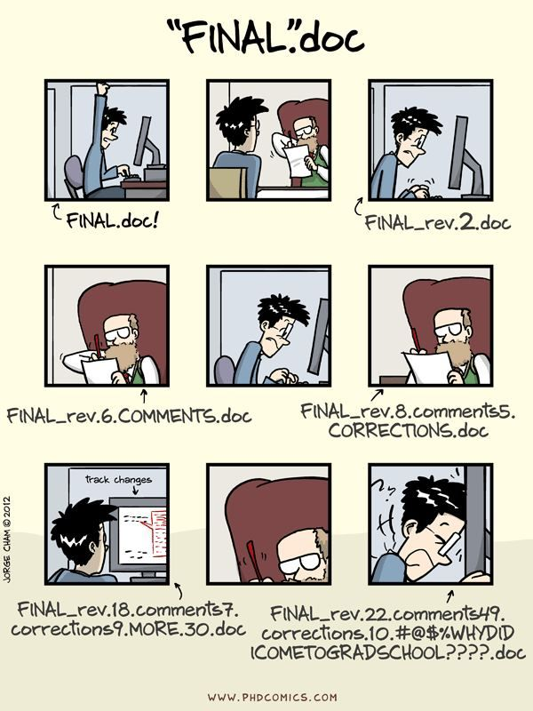
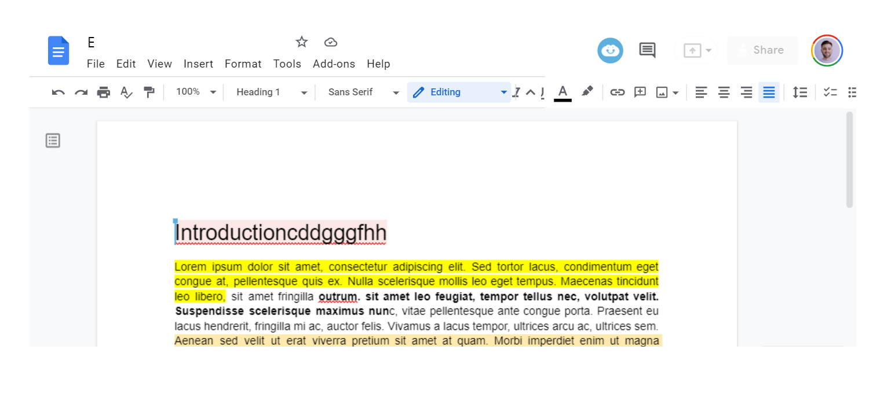
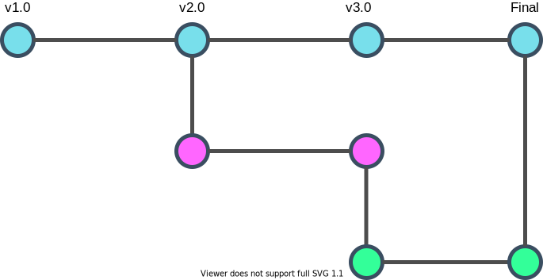
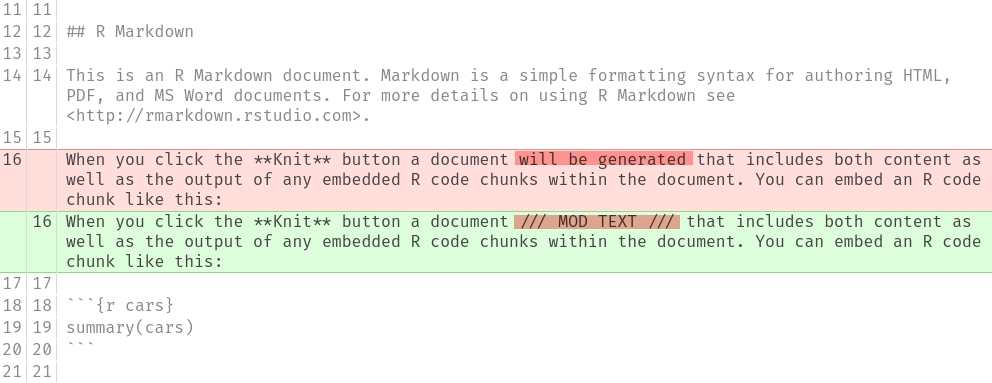
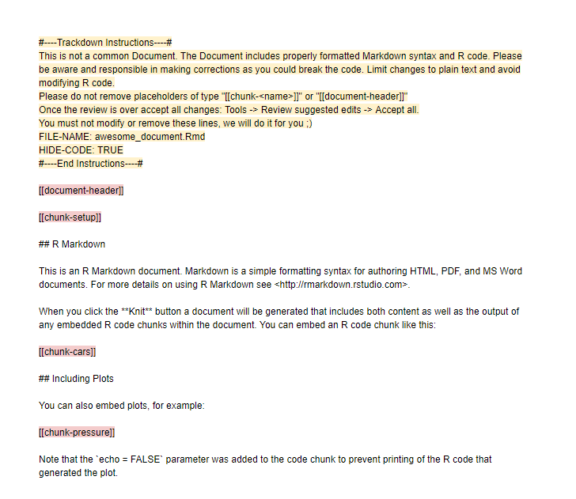
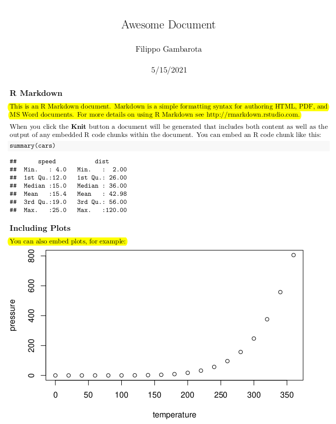
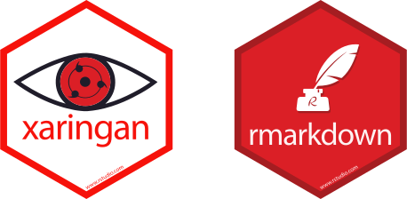

```{r setup, include=FALSE}
options(htmltools.dir.version = FALSE)
knitr::opts_chunk$set(echo = F, fig.align = "center")

xaringanExtra::use_panelset()

# File name Setup

filename = stringr::str_replace(knitr::current_input(), ".Rmd", "")

# Packages

# Loading

```

class: title-slide

# trackdown

### Collaborative writing through literate programming in R

<br/>

#### @TASK4-2021 - 19/05/2021

.pull-left[
#### Filippo Gambarota<sup>1</sup>
#### Claudio Zandonella Callegher<sup>1</sup>
#### Janosch Linkersdörfer<sup>2</sup>
]

.pull-right[
#### Mathew Ling<sup>3</sup>
#### Emily Kothe<sup>3</sup>
]

.footnote[
[1] University of Padova

[2] University of California

[3] Deakin University
]

---
class: inverse, center, middle

# A normal academic day...

---
# Writing

.pull-left[

<iframe src="https://giphy.com/embed/LGWYfM9Dd7Kuc" width="480" height="270" frameBorder="0" class="giphy-embed" allowFullScreen></iframe>

]

--

.pull-right[

* Writing bibliography

<br/>

* Copy and paste statistics and results `r emo::ji("scream")`

<br/>

* Tables and figures `r emo::ji("scream")`

<br/>

* Collaboration

]

---

# What about collaboration and file versions?

```{r, out.width="35%"}

```

---
class: section-slide, center, middle

# Is there a solution? `r emo::ji("scream")`
---

class: inverse, center, middle

# YES! <br/> Literate programming 😍

---

--

.pull-left[

## Code

```{r, eval=FALSE, echo = T}

# Plotting
plot(data)

# Computing mean
mean(data$response)

# Statistics
t.test(response ~ condition)
```

]

--

.pull-right[

## Text

```{r}
knitr::include_graphics("img/lorem_ipsum.png")
```

]

--

These components are usually separated...

---

# Literate programming...

Is a combination of **text** and **code** in order to produce high-quality, reproducible and scalable documents.

.pull-left[

```{r, out.width="30%"}
knitr::include_graphics("img/latex.svg")
```

```{r, out.width="30%"}

```

```{r, out.width="30%"}
knitr::include_graphics("img/r_logo.svg")
```

]

.pull-right[

```{r, out.width="50%"}
knitr::include_graphics("img/knitr.svg")
```

]

---

# An example...

```{r out.extra='style="border: none;"'}
knitr::include_url("files/awesome_document.txt")
```

---
# An example...

```{r out.extra='style="border: none;"'}
knitr::include_url("files/example_rmd.html")
```
---

class: inverse, center, middle

# This is great! But what about collaboration?

---
# Literate programming as asynchronus process...

```{r, out.extra='style="border: none;"'}

```

---

# Literate programming as asynchronus process...

```{r}
knitr::include_graphics("img/literate_programming.svg")
```

---
class: inverse, center, middle

# Collaboration on plain text files

---

The gold standard way to collaborate on plain text files is using a **version control** system:

.pull-left[

```{r, out.width="50%"}
knitr::include_graphics("img/git.svg")
```

```{r}

```

]

.pull-right[

* .green[**Avoid multiple file version tracking a history**]

<br/>

* .green[**Professional way to manage projects with multiple people**]

<br/>

* .red[**Not intuitive and very different from a standard workflow**]

]

---
# GIT is powerful but tracking narrative is hard

.pull-left[

**Word-like approach**

```{r, out.extra='style="border: none;"'}

```


]

.pull-right[

**GIT Diff**

```{r}

```

]

---
class: inverse, center, middle

# In an ideal world...

---

# In an ideal world...

* Work using a **literate programming** framework
* **Collaborate on plain text files** similarly as we usually do with Word or Google Docs

<br/>
<br/>

## This is the aim of the **trackdown** package

---
class: inverse, center, middle

# The big picture...

---
# The big picture...

```{r}
knitr::include_graphics("img/trackdown_big_picture.svg")
```

---
class: inverse, center, middle

# The trackdown package

---

# The trackdown package

```{r, out.width="80%"}
knitr::include_graphics("img/trackdown_package.svg")
```

---

class: inverse, center, middle

# A suggested workflow

---

# A suggested workflow

```{r}
knitr::include_graphics("img/workflow.svg")
```

---
class: inverse, center, middle

# How a trackdown file looks like?
---

# How a trackdown file looks like?

--

.pull-left[

```{r out.extra='style="border: none;"'}
knitr::include_url("files/awesome_document.txt")
```

]

--

.pull-right[

```{r out.extra='style="border: none;"'}
knitr::include_url("https://docs.google.com/document/d/1wGUY0SlDbt9zJZodJtTsjd338Aats8n_4nP1F8gCAac/edit")
```

]

---
# Also the final output

* With the `upload_file()` function is possible to also upload the output document as `.pdf` or `.html`

.pull-left[

```{r}

```

]

.pull-right[

```{r, out.width="70%"}

```

]

---
class: inverse, center, middle

# Other advantages of the plain-text + Google Docs approach
---

# Other advantages of the plain-text + Google Docs approach

--

* Collaboration with .red[**colleagues with a heterogeneous background**] while keeping all advantages of a **knitr** based document

--

<br/>

* .red[**Spell checking**] using standard tools available online (not completely possible in RStudio)

<br/>

--

* All amazing .red[**collaboration tools available in Google Docs**] (comments, assignments, history, auto-saving, etc.)


---
# Check our repo on Github...

[**ClaudioZandonella/trackdown**](https://github.com/ClaudioZandonella/trackdown) `r icons::fontawesome("github")`

```{r out.extra='style="border: none;"'}
knitr::include_url("https://github.com/ClaudioZandonella/trackdown")
```


---
class: split-five

# The developers 😎

.column[
```{r, out.width="70%", fig.cap="<a href='mailto:filippo.gambarota@phd.unipd.it'>Filippo Gambarota</a>"}
knitr::include_graphics("img/filippo.jpg")
```
]

.column[
```{r, out.width="70%", fig.cap="<a href='mailto:claudiozandonella@gmail.it'>Claudio Zandonella <br/> Callegher</a>"}

```
]

.column[
```{r, out.width="70%", fig.cap="<a href='mailto:jlinkersdoerfer@ucsd.edu'>Janosch Linkersdörfer</a>"}
knitr::include_graphics("img/janosch.jpg")
```
]

.column[
```{r, out.width="70%", fig.cap="<a href='mailto:m.ling@deakin.edu.au'>Mathew Ling</a>"}
knitr::include_graphics("img/mathew.jpg")
```
]

.column[
```{r, out.width="70%", fig.cap="<a href='mailto:emily.kothe@deakin.edu.au'>Emily Kothe</a>"}

```
]

---
class: psicostat

# A special thanks to Psicostat members...

Check our [**website**](https://psicostat.dpss.psy.unipd.it/index.html) `r emo::ji("smile")`

```{r out.extra='style="border: none;"'}
knitr::include_url("https://psicostat.dpss.psy.unipd.it/index.html")
```

---

class: final-slide, center, middle

<br/>
<br/>

### .large[[filippo.gambarota@phd.unipd.it](mailto:filippo.gambarota@phd.unipd.it)]

<br/>
<br/>

.tiny[Slides made with the [Xaringan](https://github.com/yihui/xaringan) package by [Yihui Xie](https://yihui.name/)]

```{r echo=FALSE, out.width="20%"}

```