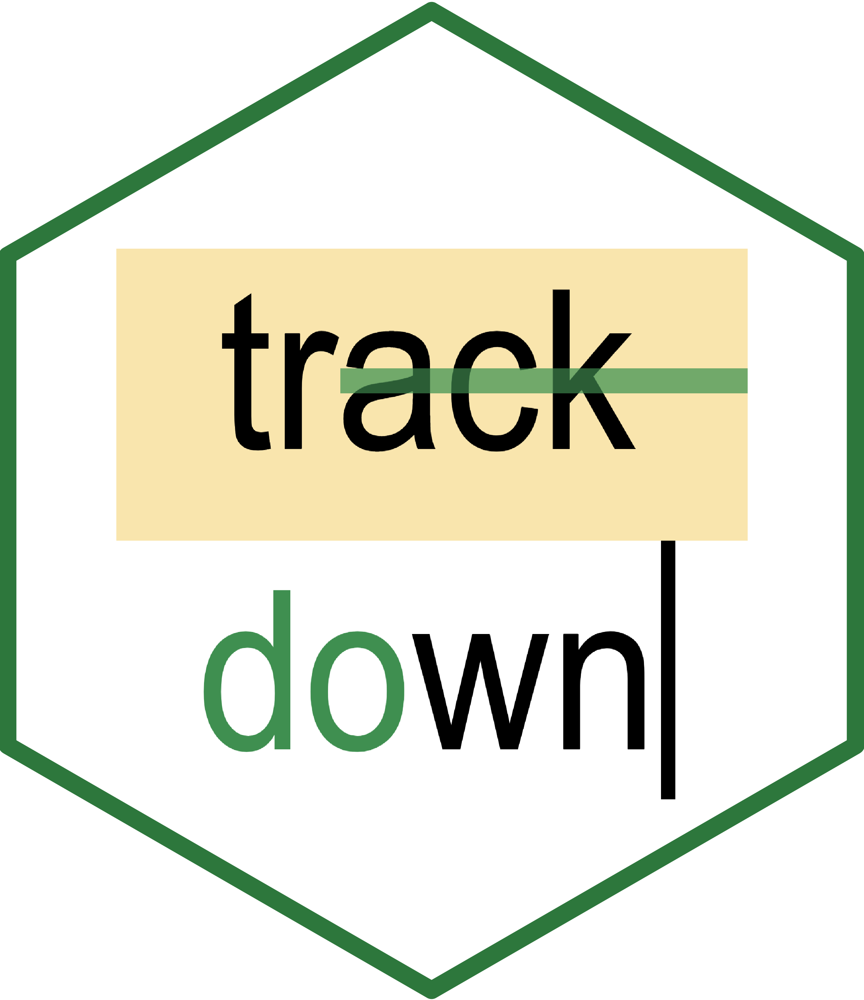
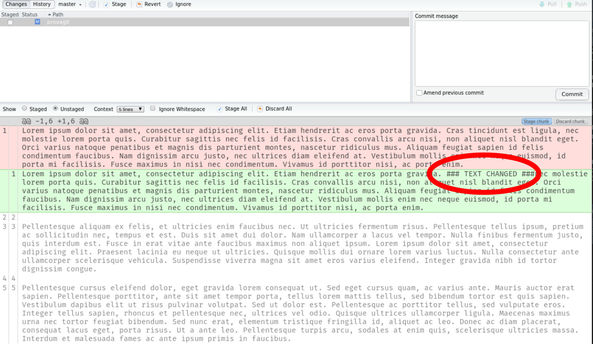

```{r setup, include=FALSE}
options(htmltools.dir.version = FALSE)
knitr::opts_chunk$set(echo = F, fig.align = "center")
```

class: title-slide

```{r, out.width="30%"}

```

# A simple framework for collaboration in a literate programming workflow

### @useR 2021

---

class: chapter-slide, center, middle

# Literate programming in R

---
class: fullscreen

```{r, out.extra='style="border: none;"'}
knitr::include_url("https://rmarkdown.rstudio.com/index.html", height = 600)
```

---

# Amazing packages for different kinds of documents

```{r}
knitr::include_graphics("img/literate_hex.svg")
```

---

class: center

# What about collaboration?

--

```{r, out.extra='style="border: none;"'}
knitr::include_url("https://giphy.com/embed/6ZaYjk1qC1Tby")
```

---

# Why?

.pull-left[

* We have to collaborate both with ne**R**d people and the average Microsoft Word user `r emo::ji("scream")`

* We have to collaborate on **plain text files** (`.Rmd` or `.rnw`) so before the compilation stage

* We **lack of a collaborative environment** for text-based documents such as the revision mode of Microsoft Word or Google Docs

]

--

.pull-right[

```{r, out.extra='style="border: none;"'}
knitr::include_url("https://giphy.com/embed/xU9TT471DTGJq")
```
]

---
class: chapter-slide, centre, middle

# Wait! we have GIT for collaboration on plain text files! 😎

---

# GIT is powerful! but not for text-based documents! `r emo::ji("sad")`

--

.pull-left[

```{r, fig.cap="With standard reviewing tools", out.height="350"}
knitr::include_graphics("img/word_based.png")
```

]

--

.pull-right[

```{r, fig.cap="Using GIT", out.height="350"}

```

]

---

class: chapter-slide, center, middle

# In an ideal world...

---

## We need a tool that:

--

* Allow us to easily collaborate in the same way as a standard Word file

--
* Is user friendly for the average user and powerful for experts

--
* Keep all powerful aspects of a literate programming framework, without any compromises

--

```{r, out.extra='style="border: none;"'}
knitr::include_url("https://giphy.com/embed/EldfH1VJdbrwY")
```

---
class: center, middle

# This is the main aim of the trackdown package 😎

```{r, out.width="30%"}

```
---
class: chapter-slide, center, middle

# The big picture

---
# The big picture

```{r}
knitr::include_graphics("img/workflow.svg")
```

---

class: chapter-slide, center, middle

# trackdown::upload_file()

---
class: fullscreen

<!---
Thanks to Andy Field https://stackoverflow.com/questions/32823436/auto-full-screen-iframe-video-without-using-any-api
-->

<video width="100%" height="100%" controls id="my_video">
    <source src="video/speed/upload_and_googledrive.mp4" type="video/mp4">
</video>

---

class: chapter-slide, center, middle

# Sharing on Google Docs

---
class: fullscreen

<video width="100%" height="100%" controls id="my_video">
    <source src="video/speed/share.mp4" type="video/mp4">
</video>

---

class: chapter-slide, center, middle

# Starting the review process

---
class: fullscreen

<video width="100%" height="100%" controls id="my_video">
    <source src="video/speed/edit-1.mp4" type="video/mp4">
</video>

---

class: chapter-slide, center, middle

# trackdown::download_file()

---
class: fullscreen

<video width="100%" height="100%" controls id="my_video">
    <source src="video/speed/download_file.mp4" type="video/mp4">
</video>

---
class: fullscreen

# Check our repo on Github...

[**ekothe/trackdown**](https://github.com/ekothe/trackdown/tree/develop) `r icons::fontawesome("github")`

```{r out.extra='style="border: none;"'}
knitr::include_url("https://ekothe.github.io/trackdown")
```

---
class: split-five, fullscreen

# The developers 😎

.column[
```{r, out.width="70%", fig.cap="<a href='mailto:filippo.gambarota@phd.unipd.it'>Filippo Gambarota</a> <br/> <br/> University of Padova"}
knitr::include_graphics("img/filippo.jpg")
```
]

.column[
```{r, out.width="70%", fig.cap="<a href='mailto:claudiozandonella@gmail.it'>Claudio Zandonella <br/> Callegher</a> <br/> <br/> University of Padova"}
knitr::include_graphics("img/claudio.jpeg")
```
]

.column[
```{r, out.width="70%", fig.cap="<a href='mailto:jlinkersdoerfer@ucsd.edu'>Janosch Linkersdörfer</a> <br/> <br/> University of California"}

```
]

.column[
```{r, out.width="70%", fig.cap="<a href='mailto:m.ling@deakin.edu.au'>Mathew Ling</a> <br/> <br/> Deakin University"}
knitr::include_graphics("img/mathew.jpg")
```
]

.column[
```{r, out.width="70%", fig.cap="<a href='mailto:emily.kothe@deakin.edu.au'>Emily Kothe</a> <br/> <br/> Deakin University"}
knitr::include_graphics("img/emily.jpeg")
```
]

---
class: psicostat, fullscreen

# A special thanks to Psicostat members

Check our [**website**](https://psicostat.dpss.psy.unipd.it/index.html) `r emo::ji("smile")`

```{r out.extra='style="border: none;"'}
knitr::include_url("https://psicostat.dpss.psy.unipd.it/index.html")
```

---
