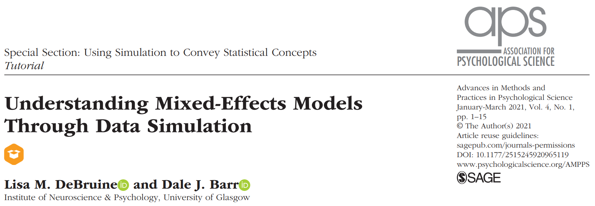

```{r setup, include=FALSE}
options(htmltools.dir.version = FALSE)
knitr::opts_chunk$set(
  fig.width=9, fig.height=3.5, fig.retina=3,
  out.width = "100%",
  fig.align = "center",
  cache = FALSE,
  dev = "svg",
  echo = TRUE,
  message = FALSE, 
  warning = FALSE,
  hiline = TRUE
)

iframe <- function(link, w, h){
    sprintf('<iframe src="%s" width="%s" height="%s" frameBorder="0"></iframe',
            link, w, h)
}


library(tidyverse)
library(patchwork)
library(metafor)
library(here)
library(distributional)
library(ggdist)
library(latex2exp)
library(RefManageR)

source(here("R/utils-rmd.R"))
source(here("R/utils.R"))

funs <- get_funs(here("R", "utils.R"))
source(here("R", "imgs.R"))
imgs <- readRDS(here("objects", "r-imgs.rds"))

BibOptions(check.entries = FALSE, bib.style = "authoryear", style = "markdown",
           dashed = TRUE)
bib <- ReadBib(here("slides", "ref.bib"))
```

class: inverse, center, middle

```{r xaringan-themer, include=FALSE, warning=FALSE, eval=FALSE}
library(xaringanthemer)
style_duo_accent(
  primary_color = "#1381B0",
  secondary_color = "#FF961C",
  inverse_header_color = "black"
)
# style_mono_accent(base_color = "#43418A")
```

# The starting point...

---

# The starting point...



---

# The starting point...

- linear **mixed-effects models** (LMM) are **powerful**, **useful** and often there is **no plausible alternative**
- implementing LMM can be easy but understanding the theory/assumptions or interpreting results can be hard
- simulating data can be an useful tool to understand LMM, **BUT**:

--

**while(TRUE){**

.center[

</center>
]
**}**

---

# However...

Just **understanding a little bit of theory can be enough to set-up a VERY useful simulation** then by seeing the simulation result we can understand more about the theory.

.center[
`r iframe("https://giphy.com/embed/StKiS6x698JAl9d6cx", 400, 400)`
]

---
class: inverse, center, middle

# A quick example

---

# A quick example, Welch t-test <sup>1</sup>

We are learning the t-test, and we read that if the two sample comes from populations with the same variance, we can use the regular t-test otherwise we should use the so-called Welch t-test.

```{r, echo = FALSE, out.width="80%"}
equal <- ggplot() +
    xlim(c(-5, 6)) +
    stat_function(geom = "area", fun = dnorm, args = list(mean = 0, sd = 1),
                  aes(fill = "Treated"),
                  alpha = 0.5) +
    stat_function(geom = "area", fun = dnorm, args = list(mean = 1, sd = 1),
                  aes(fill = "Control"),
                  alpha = 0.5) +
    theme_minimal(base_size = 15) +
    theme(legend.title = element_blank(),
          legend.position = "none")


unequal <- ggplot() +
    xlim(c(-6, 8)) +
    stat_function(geom = "area", fun = dnorm, args = list(mean = 0, sd = 1),
                  aes(fill = "Treated"),
                  alpha = 0.5) +
    stat_function(geom = "area", fun = dnorm, args = list(mean = 1, sd = 2),
                  aes(fill = "Control"),
                  alpha = 0.5) +
    theme_minimal(base_size = 15) +
    theme(legend.title = element_blank(),
          legend.position = "none")

(equal / unequal)
```


.footnote[[1] http://daniellakens.blogspot.com/2015/01/always-use-welchs-t-test-instead-of.html]

---

# Cool! but why?

Without looking at the formula, let's simply try to simulate a t-test where we know the two populations have different variance and also simulate different sample size between the two groups:

```{r}
nsim <- 1e4

n0 <- 30
n1 <- 20
m0 <- 0
m1 <- 0
sratio <- 3

equal_t <- vector(mode = "list", length = nsim)
unequal_t <- vector(mode = "list", length = nsim)

for(i in 1:nsim){
  g0 <- rnorm(n0, m0, 1)  
  g1 <- rnorm(n1, m0, sratio)
  equal_t[[i]] <- t.test(g0, g1, var.equal = TRUE)
  unequal_t[[i]] <- t.test(g0, g1, var.equal = FALSE)
}
```

---
# Cool! but why?

```{r, eval = FALSE}
p_equal <- sapply(equal_t, function(x) x$p.value)
p_unequal <- sapply(unequal_t, function(x) x$p.value)

mean(p_equal <= 0.05)
mean(p_unequal <= 0.05)
```

```{r, echo = FALSE}
sim <- readRDS("../objects/sim-welch.rds")
sim <- unnest(sim, tidy)
mean(sim$p[sim$type == "standard"] <= 0.05)
mean(sim$p[sim$type == "welch"] <= 0.05)
```

The probability of making type-1 error is almost two times higher when using the standard t test `r emo::ji("scream")`.

---
# Cool! but why?

Let's have a better look at the simulation results. We find the answer! The standard error is systematically lower using the standard t-test thus increasing the t value and the number of low p-values inflating the type-1 error rate.

```{r, echo = FALSE, fig.width=13, fig.height=5}
se_plot <- sim |> 
    ggplot(aes(x = se, fill = type)) +
    geom_density(color = "black",
                 alpha = 0.5) +
    ggthemes::theme_par(base_size = 15) +
    theme(legend.position = c(0.8,0.8),
          legend.title = element_blank()) +
    xlab("Standard Error")

pvalue_plot <- sim |> 
    ggplot(aes(x = p, fill = type)) +
    geom_density(color = "black",
                 alpha = 0.5) +
    ylim(c(0, 2.5)) +
    ggthemes::theme_par(base_size = 15) +
    theme(legend.position = c(0.8,0.8),
          legend.title = element_blank()) +
    xlab("P-value")

pvalue_plot | se_plot
```
---
# Cool! but why?

.pull-left[

### Standard t-test

$$t = \frac{\bar{X_1} - \bar{X_2}}{s_p\sqrt{\frac{1}{n_1} + \frac{1}{n_2}}}$$

$$s_p = \sqrt{\frac{(n_1 - 1)s_1^2 + (n_2 - 1)s_2^2}{n_1 + n_2 - 2}}$$

]

.pull-right[

### Welch's t-test

$$t = \frac{\bar{X_1} - \bar{X_2}}{\sqrt{SE^2_{\bar X_1} + SE^2_{\bar X_2}}}$$
$$SE_{X_i} = \frac{s_i}{\sqrt{n_i}}$$
]

.footnote[Also the degrees of freedom calculation is different between the two approaches]

---
class: inverse, center, middle

# What about meta-analysis?

---

# What about meta-analysis?

Meta-analysis and mixed-effects models have a lot in commons:

- also meta-analysis are very useful, especially in the context of the scientific crisis in psychology
- they are used a lot but not always the theory and the interpretation is clear
- also from the statistical point of view, random-effects models and meta-analysis are very similar

For this reason, we decided to apply the same idea of Debruine and Barr `r Citep(bib, "DeBruine2021-su")` to meta-analysis!

---

# Another coincidence...

Beyond the Debruine and Barr `r Citep(bib, "DeBruine2021-su")` work, we also had to calculate the statistical power for a multi-lab study. Again, multi-lab studies have a lot in common with meta-analysis and calculating statistical power with simulations is very easy and flexible!

.pull-left[

### Multi-lab study

- different research groups performing the same experiment
- the statistical unit is the research group
- the difference between research groups (i.e., heterogeneity) could impact the results

]

.pull-right[

### Meta-analysis

- collecting published studies on a research topic
- the statistical unit is the published study
- the difference between studies methods (i.e., heterogeneity) could impact the results


]

---

# Veeeery quick intro about meta-analysis!

.center[

</center>
]

---
# Veeeery quick intro about meta-analysis!

By switching the statistical unit one level up (from participants to studies) the meta-analysis can be considered as a weighted average of summary statistics (e.g., effect sizes) giving more weight (i.e., trusting more) studies with higher sample size and/or less variability.

```{r, echo=FALSE}
library(metafor)
yi <- c(0.2, 0, 0.1, 0.5)
vi <- c(0.1, 0.05, 0.2, 0.3)
fit <- rma(yi, vi)
forest(fit)
```

---
# Overall simulation setup

```{r, echo = FALSE, out.width="50%"}
knitr::include_graphics("img/flow.svg")
```

---
class: inverse, center, middle

# Let's simulate!

---
# Simulating a single study

The easiest way is starting by simulating a single study. Let's assume that we are assessing the effect of a new treatment comparing two groups. We simulate that the true effect size in Cohen's $d$ scale is $d = 0.4$. Each study hypothetical study of our meta-analysis collected $n = 30$ participants per group and measure the difference.

```{r}
set.seed(2023)
mc <- 0 # mean of the control group
mt <- 0.4 # mean of the experimental group
n <- 30 # sample size

gc <- rnorm(n, mc, 1) # control group
gt <- rnorm(n, mt, 1) # experimental group

sim <- data.frame(group = rep(c("control", "exp"), each = n),
                  y = c(gc, gt))
head(sim)
```

---
# Calculating effect size and variance

We can calculate the Cohen's $d$ and the sampling variance:

```{r}
# compute summary statistics
sim_sum <- sim |> 
    group_by(group) |>  
    summarise(m = mean(y),
              s = sd(y),
              n = n()) |> 
    pivot_wider(names_from = group, values_from = c(m, s, n))

sim_sum
```
---
# Calculating effect size and variance

We can manually calculate the Cohen's $d$ and the sampling variance or we can use the `metafor::escalc()` function that calculate basically every effect size measures:

```{r}
sim_sum <- escalc(measure = "SMD", 
       m1i = m_control, m2i = m_exp,
       sd1i = s_control, sd2i = s_exp,
       n1i = n_control, n2i = n_exp,
       data = sim_sum)
sim_sum
```

---
# Put everything into a function! <sup>1</sup>

```{r, results='asis', echo = FALSE}
print_fun(funs$sim_study)
```

.footnote[[1] This implementation is a little bit different but the result is the same!]

---
# Now we can simulate several studies!

```{r}
set.seed(2023)
sim_study(mt, n, n)
sim_study(mt, n, n)
sim_study(mt, n, n)
```

---
# Now we can simulate several studies!

Let's simulate a meta-analysis dataset with $k = 10$ studies:

```{r}
k <- 10
dat <- make_data(k, n, n, d = mt)
head(dat)
```

---
# Now we can simulate several studies!

```{r}
set.seed(2023)
res <- vector(mode = "list", length = k)

for(i in 1:k){
    res[[i]] <- sim_study(dat$d[i], dat$nt[i], dat$nc[i])
}

res <- dplyr::bind_rows(res)
dat <- cbind(dat, res)

head(dat)
```


---
# Now we can simulate several studies!

The `sim_studies()` function simply apply the `sim_study` to each row of the dataset.

```{r, echo = FALSE}
dat <- make_data(k, n, n, d = mt)
```

```{r}
set.seed(2023)
dat <- sim_studies(theta = dat$d, 
                   nc = dat$nc, nt = dat$nt,
                   data = dat)
head(dat)
```

---
# Fixed-effects model

Implicitly we simulated a **fixed-effects** meta-analysis model. This type of model assume that the there is an unique true treatment effect $\theta_f$ and each study is a more or less precise estimation of this effect:

$$d_i = \theta_f + \epsilon_i$$
$$\epsilon_i \sim \mathcal{N}(0,\sigma^2_i)$$
In our example $\theta_f = 0.4$ and the sampling variances are different for each study and they are determined mainly by the sample size of each study and by the effect size itself.

---
# Fixed-effects model

```{r, out.width="100%", echo=FALSE, fig.height=4}
imgs$fixed + coord_fixed(ratio = 0.5)
```

---
# Fixed-effects model

Now we can fit the meta-analysis model using `metafor::rma()`:

```{r}
fit_fixed <- rma(yi, vi, data = dat, method = "FE")
summary(fit_fixed)
```

---
# Fixed-effects model

```{r}
forest(fit_fixed)
```

---
# It is reasonable to assume a fixed-effects model?

The fixed effect model assume that no study-level (research group, language, nation, etc.) or participants-level features (age, sex, etc.) have an impact on the treatment effect. Quite unlikely!

```{r, echo = FALSE, fig.height=5, out.width="70%"}
(imgs$fixed + ggtitle("Fixed Effects Model") + coord_fixed(ratio = 0.5)) | (imgs$random + ggtitle("Fixed Effects Model") + coord_fixed(ratio = 0.5)) 
```

---
# Random-effects model

The random-effects model assume that the treatment effect is a distribution of effects size where in some condition the effect is high in other is low or even absent. We need an extra parameter $\tau^2$ that represent the amount of variability.

$$d_i = \theta_r + \theta_i + \epsilon_i$$
$$\theta_i \sim \mathcal{N}(0, \tau^2)$$
$$\epsilon_i \sim \mathcal{N}(0,\sigma^2_i)$$
Now, $\theta_r$ is the **average** effect across all conditions and $\theta_i$ is each study-specific adjustment to this overall effect. $\tau$ determines how much variability there is around $\theta_r$. If $\tau = 0$ the model is a fixed-effects model.

---
# Random-effects model

The impact of $\tau$ can be seen plotting the expected distribution from the random-effects model using `dnorm(x, theta_r, tau)`

```{r, echo = FALSE}
par(mfrow = c(1,3))

m <- 0.4
tau <- c(0.1, 0.2, 0.5)

curve(dnorm(x, m, tau[1]), -3, 3, xlab = "Effect Size", ylab = "", main = latex2exp::TeX("$\\tau = 0.1$"))
curve(dnorm(x, m, tau[2]), -3, 3, xlab = "Effect Size", ylab = "", main = latex2exp::TeX("$\\tau = 0.2$"))
curve(dnorm(x, m, tau[3]), -3, 3, xlab = "Effect Size", ylab = "", main = latex2exp::TeX("$\\tau = 0.5$"))
```

---
# Random-effects model

We can easily extend the previous approach by simulating each study not using the same effect but using a vector of effects with variability fixed to $\tau$:

```{r}
set.seed(2023)
k <- 10 # number of studies
tau2 <- 0.2 # heterogeneity

# simulate the dataset
dat <- make_data(k = 10, n, n, theta_r = mt)

# simulating the study-specific theta_i
dat$theta_i <- rnorm(k, 0, sqrt(tau2))

# real effect size for each study
dat$theta_r_theta_i <- dat$theta_r + dat$theta_i

head(dat)
```

---
# Random-effects model

```{r}
set.seed(2023)
dat <- sim_studies(theta = dat$theta_r_theta_i, nt = dat$nt, nc = dat$nc,
                   data = dat)

head(dat)
```

---
# Random-effects model

Similarly, we can fit the random-effects model with the `metafor::rma()` function:

```{r}
fit_random <- rma(yi, vi, data = dat, method = "REML")
summary(fit_random)
```

---
# Random-effects model

```{r}
forest(fit_random)
```

---
# Power analysis

- In the context of meta-analysis or multi-lab studies, the power analysis is determined by the number of studies and the number of participants in each study.

- There are some methods to compute the power analytically `r Citep(bib, "Borenstein2009-mo")` but they make some strong assumptions (e.g., the sample size is the same for each study)

.center[
`r iframe("https://giphy.com/embed/BtEw37CXZti8yfq3Ke", 400, 400)`
]

---
# Power analysis

The idea is very simple:

- Choose some parameters for the sample size, number of studies, true effect and $\tau$
- Repeat the simulations that we did before for several times (e.g., 10000)
- Extract the p-value of the average effect from each iteration
- Calculate the proportion of p-values equal or lower the $\alpha$ level

Now we have the statistical power estimation using Monte Carlo simulations!

.center[
`r iframe("https://giphy.com/embed/jrutBd1N7ZhsINAPzs", 300, 300)`
]

---
# Power analysis

```{r}
set.seed(2023)
nsim <- 1000
k <- 10
n <- 30
theta_r <- 0.3
tau2 <- 0.2
alpha <- 0.05

pvals <- replicate(nsim, {
    dat <- make_data(k, n, n, theta_r)
    dat$theta_i <- rnorm(k, 0, sqrt(tau2))
    dat$theta_r_theta_i <- with(dat, theta_r + theta_i)
    sim <- sim_studies(theta = dat$theta_r_theta_i, nt = dat$nt, nc = dat$nc)
    fit <- rma(yi, vi, data = sim, method = "REML")
    fit$pval
})

mean(pvals <= alpha)
```

---
# Power analysis

We can also use multiple conditions to create power curves:

```{r, cache = TRUE, echo=FALSE}
set.seed(2023)
nsim <- 1000 # number of simulations per condition (5000, higher is better)
k <- c(5, 15, 25, 35, 50) # number of studies
theta <- 0.4 # the average effect size
tau2 <- 0.2 # the heterogeneity
navg <- 30 # average sample size per study
nmin <- 30 # minimum sample size per study
alpha <- 0.05 # the alpha level

# creating all combinations
sim_grid <- tidyr::expand_grid(k, theta, tau2, navg, nmin, nsim)

# apply the simulation to all combinations
res <- purrr::pmap(sim_grid, do_sim)

# combine the results
res <- dplyr::bind_rows(res)
sim_grid <- cbind(sim_grid, res)
```

```{r, echo = FALSE}
title <- latex2exp::TeX(sprintf("$n_{avg} = %.1f$, $\\tau^2 = %s$, $\\theta_r = %s$, $\\alpha = 0.05$", sim_grid$navg[1], tau2, theta_r, 0.05))

sim_grid |> 
  ggplot(aes(x = k, y = power)) +
  geom_hline(yintercept = 0.8, linetype = "dashed", color = "firebrick4") +
  geom_line() +
  geom_point(size = 4, shape = 21, color = "white", fill = "black", stroke = 3) +
  theme_minimal() +
  ylim(c(0, 1)) +
  xlab("Number of studies (k)") +
  ylab("Power") +
  ggtitle(title)
```

---
# Improving the simulation

- simulating different sample sizes along the number of studies
- simulating heterogeneity in the sample sizes (each study has a different sample size)
- simulating different sample size among the two groups
- ...

---
# Preprint!

In the preprint there are more examples about multilevel/multivariate and meta-regressions models, [https://psyarxiv.com/br6vy/](https://psyarxiv.com/br6vy/) with all the code! `r emo::ji("smile")`

```{r, echo=FALSE}

```

---
# References

```{r, results='asis', echo=FALSE}
PrintBibliography(bib)
```

